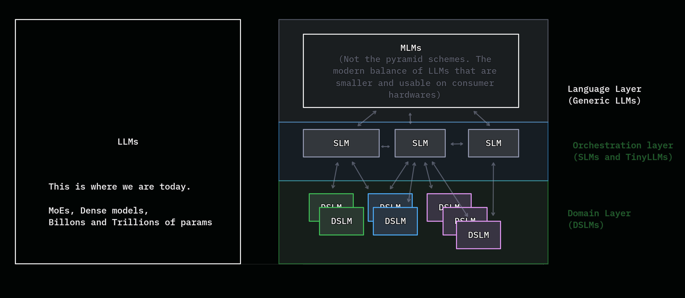

# Observations

We're all now accustomed to, or at least aware of the potential of LLMs. But there's a part of me - long interested in Language processing since my school days{{note: Writing a blog on my journey into AI, which will shine more light on this!}} that has been trying to shout into the sea of all these hypemongers{{note: I had to coin this term because the Crypto/NFT bros have taken the _influencer_ space on the dev world, and ruining it for everyone.   <iframe src="https://www.linkedin.com/embed/feed/update/urn:li:share:7447669044033564672?collapsed=0" width="100%" height="200rem" frameborder="0" allowfullscreen="" title="Embedded post"></iframe>}} - That LLMs are only one of the many huge steps ahead into our search for AI (Read as "_artificial_" and "_intelligence_" with each word taking its emphasis). It's a pity that when we say AI today, we essentially mean LLM based applications. 

Maybe GenAI (with emphasis on _generative_) could be slightly more apt. But most people don't bother to differentiate these days. (Thanks to those hypemongers)

Unlike today - when anyone can mean anything and get away with it{{note: Did you know that Merriam Webster changed their definition of _literally_ as not _literally_ and rather meaning to say it _figuratively_ while the word _figuratively_ is already existing? 🤦🏻 But that's the nature of language anyway - Etymology}} during the early days of AI, there existed a common understanding for a system of deeply narrow expertise called _Expert systems_ (They're fascinating to read, FYI). And I believe they're gonna have their revival, albeit in a much more modern way{{note: This is where I say we can't really know _how_ it'll make a comeback though}}. 

### What did LLMs unlock? 

We've discoverd a novel way to understand the world through language via language models. It _was_ surprising to know that _descriptions_ can indeed play a huge role in at least our reality here{{note: Certainly not enough though. Alan watts often speak of how limited language really can be. Like they say often - _The map isn't the terrain_}} - as evidenced by the fact of how image and video models are infact grounded in text models{{note: Which is also why we're able to get away with multi-modal models}}

But what's more interesting is the fact how much of our worldly knowledge has been encoded in the way we describe things. We've come a long way with increasing the no. of parameters on the language models thereby utilizing large corpus of human text. It's a _model_ of the way we use the language trained on a humongous corpus (hence *L*arge *L*anguage *M*odels)

But because we're fascinated by the way we are able to encode the human understanding of language in LLMs, we seem to miss some obvious clues at how much there is to go yet. We're still early. And we will only specialize from here.{{note: I can't help but facepalm myself when some people talk about how language models could be conscious. I'll come to this in a later article}}

### General VS Special
We seem to be currently enamoured with LLMs which are basically general in nature. This goes back to the age old distinction of Generalization vs Specialization{{note: Aritificial Narrow Intelligence (ANI) ⇨ Aritifical General Intelligence (AGI) ⇨ Aritifical Super Intelligence (ASI) is a topic that deserves its own space. Coming soon}}

Make no mistake - I'm not dissing on LLMs. I'm only expressing the want of deep fascination but with _patience_. Quoting a post{{note: <iframe src="https://www.linkedin.com/embed/feed/update/urn:li:share:7241691402294697984" height="200rem" width="100%" frameborder="0" allowfullscreen="" title="Embedded post"></iframe>}} I made, 

> We often misunderstand the point of a "language" model and use it as if it's a knowledge model. We think it "knows". It just "has" everything but we have to understand its limitations and come to terms with it for us to productively move beyond that line. We have come a long way, but unless we pay attention to the limitations, we slow ourselves down. Long way to go further. The best simile I can come up with right now{{note: Can't remember if I read this somewhere. Credit to the one that came up with this though!}} is as if a child is sitting at the front of a humongous library. You can ask anything and it can come up with something. Just not necessarily a meaningful correlation unless you explicitly spell it out for the kid. 

But of course, I could be wrong{{note: Why you probably shouldn't be taking this seriously.    - I'm not a linguist or a philosopher of the mind. And English isn't my native language. (Not that I'm an expert in my Native Tamil anyway!)  - I'm not an expert in NLP, NLU, or NLG. I just know _of_ them. As I build applications with foundation models, not build models from scratch. }}

Here's a tangent on why I think we'll naturally start to specialize more 

> _It's like you took a bottle of ink and you threw it at a wall. Smash! And all that ink spread. And in the middle, it's dense, isn't it? And as it gets out on the edge, the little droplets get finer and finer and make more complicated patterns, see? So in the same way, there was a big bang at the beginning of things and it spread. And you and I, sitting here in this room, as complicated human beings, are way, way out on the fringe of that bang._ ~ Alan Watts

And I think we're looking at the dense splotch on the wall right now. The edges are naturally more jagged in nature - and our language models will become more complicated and narrower in nature. 

### What do I mean by SLMs (_or even DSLMs_)

I've been developing applications for about a decade as of this writing. And my primary go-to language has always been Python. Sometime ago when I've gotten comfortable around the language, and ecosystem - I wanted to expand my horizon with other languages - primarily because I wanted different perspectives to see the world. Their problems specifically. It's been widely known that functional languages broaden your understanding on how we develop software systems.{{note: Looking at you, Haskell. Notorious for it's extremely academically-oriented, but logically impressive! Obviously I couldn't get anywhere with Haskell, or any other functional languages (like Elixir) for work, but they sure gave me a different lens to look at the programming spectrum}}. This was the time I've been writing one-off scripts in python (which has been my go-to language for a long time) and then I discovered Racket. I've been fascinated with RacketLang{{note: https://racket-lang.org}}. for their ability to create DSLs (Domain Specific Languages). And that's when it clicked - about specialization. 

I'm not talking about anything new here - Machine learning and Deep learning practictioners have been doing this day-in and day-out. _Fine-Tuning_. But we should be building more and more DSLMs (Domain specific language models) that'll work better and with more autonomy and isolated impact surface. 

Small Language Models or Domain Specific Language Models are potentially more useful for on-device inferences, and that's where we will be{{note: or should be}} going next.

### What about MoE models? 

Of course - We already have Mixture of Experts language models (which activate a subset of parameters only at any given time) - which prove to be runnable/usable on smaller devices{{note: I've been playing around with **Qwen3.6-35b-a3b** model locally and it's very interesting what language models are capable of.}} But anyone who's been playing around with local models would know that dense models are more capable than MoE models. 

Liquid FM models are insanely fast{{note: https://www.liquid.ai/models}} with such a small footprint - especially on edge devices. And Google's Gemma 4 are more _capable_ models as well. 

But they're one level deeper in the abstraction that I'm talking about. If you've been coding with sub-agents with any customizable harness, you'll know what I'm talking about. A model that's small, capable, and fast on a narrow domain is easier to build, maintain and upgrade, stable, and more secure and capable.

|  | 
|:--:| 
| From generalization to specialization |
