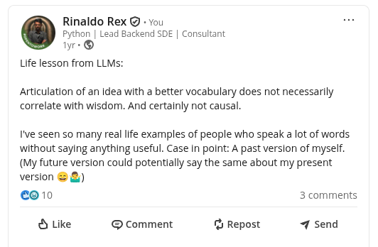

Need of the hour: AI toggle
---

Given that we're _generating_ too much content via AI, it's becoming not only unsustainable for our tiny human brain to ration attention, but also dumbing down our mind. 

> _Too much of anything is good for nothing_ 

As the proverb says.

The interesting thing about LLMs are - that they love to extract something out of anything. It's becuase that's their inherent nature. You remember that one guy/gal in your friend group that always loves to talk about anything and everything - The _pseudo_ know-it-all?{{footnote: Unfortunately, if you don't know one like that - It's probably you in the group. Don't feel bad, for we're always a know-it-all in some groups than others!}}

LLMs are like that. Here's a post I made a while back.

|  | 
|:--:| 
| *Better articulation doesn't necessarily mean better wisdom* |

LLMs as amplifier - Language models are statistical regurgitation -
