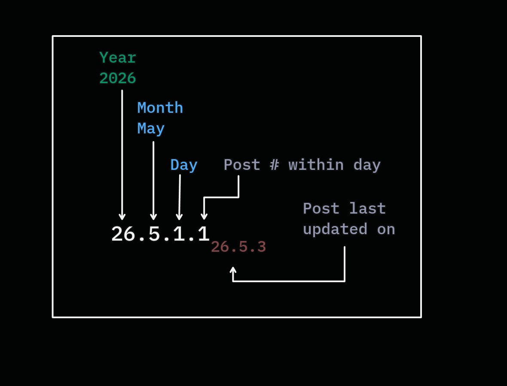

# Gravitating towards Calendar Versioning {{footnote: This is not a technical deep-dive on choosing a versioning scheme}}

> ##### Reading time: {{ #reading_time }}.

After almost a decade of being a software develoeper - I've noticed that my personal preference towards _versioning_ in software  gravitates towards Calendric Versioning{{footnote: Technically specified [CalVer](https://calver.org), semantically meaningful [SemVer](https://semver.org), and on-the-nose [PrideVer](https://pridever.org) 🤣}}. Although there are multitudes of reasonings for that, I'd like to observe a few worth noting for my own posterity. 

### Reason 1: Philosophical

Anybody who's known me throughout my formative years{{footnote: Higher secondary education through college. Or in other words, throughout my twenties}} would easily point to the fact that I've been exploring too many (schools of) philosophies too early{{footnote: Based on who you talk to, I suppose}} in life. Maybe that's why I'm naturally leaning towards the only thing that matters for "comparing" {{footnote: A better word would be _observing_ the change of entropy}} the progress of anything that's describable by human means.

And this reasoning permeats all the other reasoning because as you're probably aware, everything eventually leads back to philosophy{{footnote: For those who don't know about XKCD: 903 (Read the caption on image hover) and if you wanna visualize this, check [this](https://www.xefer.com/wikipedia) one out!}}

### Reason 2: Need for pause

I'm sure I'll be writing more about my spiritual standpoint in life - both personal and professsional, but for now I'll limit it to the entity - _time_. 

We don't really have _control_ over time{{footnote: To be frank, I'm not even sure we understand time clearly. The fact that most people can't even comprehend that spacetime is a continuum. That it's not two words as space and time 🤷}}. It proceeds forwards. 

And unfortunately, we've lost track of _perceiving_ time. To be precise - perceiving of _worthy_ time{{footnote: Kairos vs Chronos}}. Why do we rush everything these days? It makes no sense - given that the more we know, the more we should slow down to process the surplus of the information{{footnote: at least so far as to filter the noise from the signal}}. Here's how I believe we should slow down. We've somehow narrowed down on this globally recognized and acknowledge Gregorian calendar. And here's where my intuition ripens - We've spent a good number of centuries training ourselves subconsciously to follow and create patterns acknowledging this _cycle_. So why not use it so we simplify and offload the cognitive overload of "progressing" to the existing cycles and patterns?

Modern software engineering has come a long way. (Especially given that I'm writing this in 2026) And agentic engineering has kickstarted a new era of "superfast" development. We've already been plagued with the so-called agile engineering, and being pushed constantly to churn out feature after feature, fix after fix, and versions after versions. It's not sustainable. 
Oftentimes we software engineers are expected to churn too many items in a typical two-week sprint. Why build on a two week cycle in the first place? Especially in this agentic era? So sticking to the calendar sounds the perfect approach to versioning to me. There's much more to life than incrementing multiple numbers per day.

As Mario Zechner (the creator of Pi coding agent) would like to [reiterate](https://youtu.be/RjfbvDXpFls?si=hihTEzFwqN2EFhSy&t=723), Let's slow the fuck down. Let's just stick to the basic years of "cyclic" memory of our biological clocks. Let's keep it simple. We live by the day, month, and year. So let's synchronize our produce{{footnote: Also produce as in agriculture, which has always been synchronized to seasonal cycles until recent advancements of gene editing!}} to the calendar. 

### Reason 3: Makes sense for a blog

I could ofcourse simply add the date of the blog post{{footnote: Or since this is hosted on Github, you can literally just check my commit history}}. But somehow it didn't feel intuitive to me. Primarily because I randomly stop blogging altogether for a considerably long amount of time(Life happens). And it's in an eternal stagnation. People coming to my blog has to search for the date to understand that this older version of me is dumber than the current version of me{{footnote: I briefly considered my own blog-use versioning called AgeVer where instead of the chapter numbers, or the year/month/day as it is now - I'd basically have my age at the time of writing and age at the time of revising. Sounded like the apt one for a blog - but I just didn't want to reinvent another _slightly_ different wheel.}}. 

Basically provides an instant context of time. You see a post of mine under \\(26.5.1.2._{26.5.3}\\)? - You can instantly deduce the seed for that post was 2026 May 1st. And the superscript is basically when it was _significantly_ last revisited/revised (2026, May 3rd){{footnote: Of course, I have the "last updated" footer enabled on each page - But you can basically skip the post by seeing the date on the TOC. Neat isn't? }}. That's all you gotta know about a blog. If you're reading this blog in the future and it hasn't been updated or revisited by me to update my growth in how my perspective has shifted (or hardened), you can safely ignore any strong notions I had about it. 

|  | 
|:--:| 
| *An example of how I use CalVer on this blog* |

### Antithesis: Critical software

Now that I've laid out why calendar versioning is relatively more attractive to me over other versioning - here's a reason why any of the above shouldn't matter at all: __*For any critical piece of software or library with frequent changes.*__

Semantic version serves better for those situations. It's much more intuitive to understand _breaking_ changes, _compatibility_ concerns, _security_ implications in semantic versions over other versioning schemes.

 
 
 
 
 
 
 
