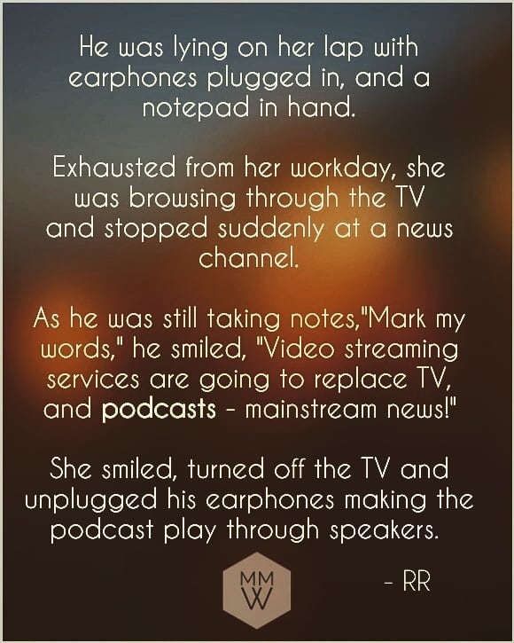

Mark My Words!
---

A long time ago - Around 2018, It was a calmer period on Instgram. People were'nt as overwhelmed or overstimulated via instgram as much. I was excited by random things that I was coming across - and wanted to add to the stimulation. (Yeap, my bad). I started with something called "Mark my words" - A series of predictions (as if I'm Nostradamus) that I thought would come to fruition. And oh boy did some of those did come true! {{footnote: It's a hit or miss. Ofcourse I'm gonna talk about only that came true. Duh!}} {{footnote: [Confirmation Bias](https://en.wikipedia.org/wiki/Confirmation_bias) for those who don't know about common biases!}}

|  | 
|:--:| 
| *[By me, Feb 2018, on Instagram](https://www.instagram.com/p/BfvmgWlhaVv/?utm_source=ig_web_copy_link&igsh=NTc4MTIwNjQ2YQ==)* |

Even though I'm just reading into it - (and simply just trying to boast as if my so called predictions are meaningful) I thought it was something that I should still pursue. 

### Why? 

Because I think that it's an interesting attempt at understanding the "contemporary times" better for myself. What good is being ahead of the curve if I don't put that into use? 

I wanted to start a podcast of my own too!{{footnote: I even went on a spree of getting a Moano microphone to do that. Alas, I was late to the party!}}  

And just like most other "incomplete" projects of mine, that stagnated. Today - There're way too many podcasts out there, that starting one not only feels daunting and more "exploiting", but also like adding just more noise. Because most podcasts today are nothing but just noise. 

### So what now? 

I'm thinking of doing more such interesting predictions under the same series. 

Are they really predictions? Not really{{footnote: For those who takes this too seriously: These aren't _real_ predictions. They are just observations that I believe people are overseeing at the time of its existance}}. But just like I believe that it'll help me understand the times better, I believe it'll help others as well. Worst case, it'll just kickstart a conversation. An ice breaker. 

Stay tuned for some wild predictions! (Not really, since some are going to be plain obvious! 😂)
