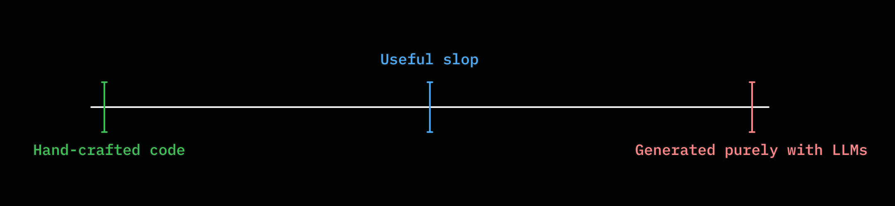

# Surfing against the slop

On May, 2026 - I wrote a blog post about the word [_slop_](./writing_in_the_age_of_slop.md). 

And as it is with every text written since time immemorial{{note: Not a jab at the religious scriptures or ancient times. Or _is it?_ }}, the _perceived_ meaning was misinterpreted by a few of my friends{{note: Those who never bothered to consider my other posts on AI throughout my years!}} as me saying that any AI-Generated content is _slop_. 

Far from the reality. Interesting thing about words is that they're very powerful. {{note: IIRC, a Bruce Lee's video saying - "Hence why its called _spelling_}} In the sense that a word _elicits_ a _feeling_ in us. One other such word(prefix) that unfortunately got slaughtered by usage is _Pseudo-_. You talk to someone about something intellectually stimulating(at least for you) and if they want to dismiss you, they can simply prefix the whole thing with _pseudo_-intellectual talk. And boom - Goes the meaning. Wiped.

And the same goes for Slop. One end of the spectrum is where you're just in awe of one-shotting so many things without any care in the world about what or how something is being built, especially the why. And the other end of the spectrum is fully hand-coding everything. The traditional software engineering. 

But if you know me, I'd always simply say that life isn't starkly black and white and that there are grey areas. That's exactly where the meaning of what _I_ consider slop is.

## Surfing the _grey_ between the extemists

We're still _early_{{note: If you take a look at my career [timeline](./my_journey_into_ai.md), you'll notice how far we've come - Or at least my understanding of AI has come}}. Between hand-coding everything, and prompting away everything - there's a middle ground - blurred, mispositioned, and often becomes the region that people debate endlessly on social media{{note: If you've been following some of our industry ramblings - You know the one about _reading code_}}. And that's also what I'm gonna say a few words about. 

## _Surfing_ the wave without falling

_Build something you use, even if by **others'** definition it is still slop_.

|  | 
|:--:| 
| Spectrum of _sloppiness_ |

When we discuss the question of _should we still be reading the code we generate with AI_, I honestly believe we're asking the wrong question. As any seasoned developer would say, _It depends_. 

And a better question could be, _How should we now learn what to still care about, and what not to, in the __coding__ aspect of software engineering_

Isn't it funny that even after so much talk about _context_, context engineering, context length, etc - We still fail to see that _context_ matters a lot? It's never one or the other. As a favourite quote of mine goes, 

> “The word "good" has many meanings. For example, if a man were to shoot his grandmother at a range of five hundred yards, I should call him a good shot, but not necessarily a good man.”     ~ G.K.Chesterton

By slop I mean building things that doesn't need to be built in the first place. _Low effort_ not in terms of creating something quickly, but in terms of _low impact_ while being shiny. And finally - If something is _useful_, is it even _slop_?{{note: Ah, the paradox of _useful slop_}}. And just so I'm clear here - Being useful doesn't necessarily mean monetary/professional benefit alone. If it is fun for you with the slop you created, its the _surfing_ I mean.{{note: If something is too brittle for real use - no matter how small of a use that is, including generating joy, it can be safely discarded as useless slop. You can't ride the wave that way}}

### Case in point

I don't code in Rust. This blog was built with MdBook - A Rust static site builder. If I had to follow the traditional engineering, I should get around to spending a couple hours getting meaningfully good at understanding at least the _preprocessor_ scope of mdbook so I can write my own preprocessors. But that's a learning effort that _feels_ heavy and that is why it took me this long to revive this blog. 

_Agentic engineering_ made it possible for me to develop a few of the preprocessors that I use on this blog. I _didn't_ bother _understanding_ the code that agents produced.

  - Inline popover notes{{note: Like this one 😜}} gives a better reading experience, and it was possible only because I could _whip_ up [mdbook-inplace-notes](https://github.com/rinaldo-rex/mdbook-inplace-notes).
  - [Timeline](./my_journey_into_ai.md) of career journey was possible with [mdbook-timeline](https://github.com/rinaldo-rex/mdbook-timeline).
  - Sticky banners atop the page across the book was possible via [mdbook-utils](https://github.com/rinaldo-rex/mdbook-utils)
  - ... and the adventure hasn't stopped here.

Nobody needs any of this. It's not going to be useful in the long run. They're one-off plugins that are a means to an end{{note: Which here is _reading experience_ of this blog}} 

I wasn't ready to learn Rust at this point in time but what I did learn though - was _harness engineering_ with Pi, and building and playing around with extensions to support _my_ software development workflows. And as I always say - _There's always a tradeoff_{{note: And the tradeoff here is picking my battles or which will offer me more fun along the way!}}

That's it - That's the secret: Build something that you'll use, have fun with, and explore: not because of the hype and FOMO, but because you're genuinely inspired to.
