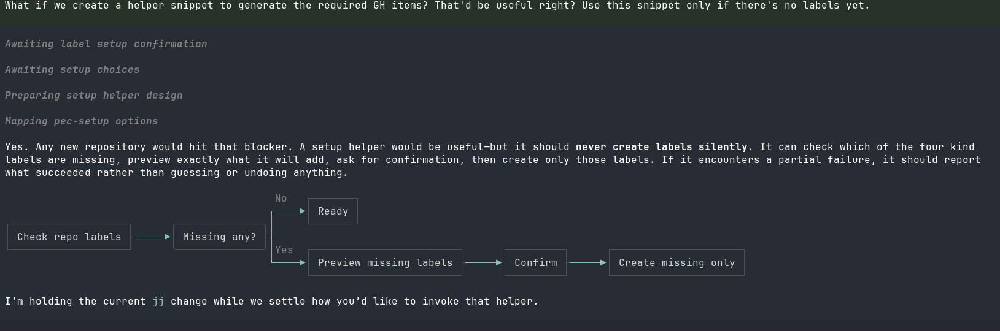

# Creative ways to talk with your LLMs

LLMs are fun to play around with. Because you can basically _instruct_ an LLM to follow a certain linguistic pattern, it's just ridiculously fun to have interesting, _fun_ ways of interactions with them. Following are some of my favourites from my sessions in Pi.

### Stop dumping text onto me!

I'm reiterating this - LLMs are _language **models**_. They have a model of the linguistic features and the vocabulary. They can convey a thing, a notion, an idea, a concept in myriad ways. Think thesaurus on steriods, but that thesaurus can reason about the language mathematically in addition to semantically{{note: Because the text is trained on human _usage_ of the language rather than the dictionary usage of the vocabulary}}. This is to say that LLMs can adhere to different ways of representing a textual notion. All you gotta do is, ask it to do so. 

And fortunately{{note: As of this writing - Both the frontier labs - Anthropic and OpenAI had released OPUS 5.5 and GPT-6 SOL/LUNA respectively. They're a stellar improvement on the language articulation from the models}} it only keeps getting better. That does not mean you can't experiment with your own style of communication. 

Typically, LLMs are eager to dump text onto the user. It's a hassle to read that - Creates real fatigue and takes the joy out of _thinking about the problems/challenges_. So try the following in your root AGENTS.md file.{{note: For pi, it's `~/.pi/agent/AGENTS.md`}}

> When explaining a workflow or decision flow during discussion, render a
 concise Mermaid flowchart directly in the response using a top-level mermaid
 block. Keep labels short and the graph narrow enough for terminal rendering;
 do not wrap it in a quote, nest it in another code block, or save it as a
 repository artifact unless requested. Use diagrams to clarify flow, not to
 replace necessary decisions or requirements.

Wanna see what this does to your interactions with models in Pi?

|  | 
|:--:| 
| A picture is worth a thousand words! |
