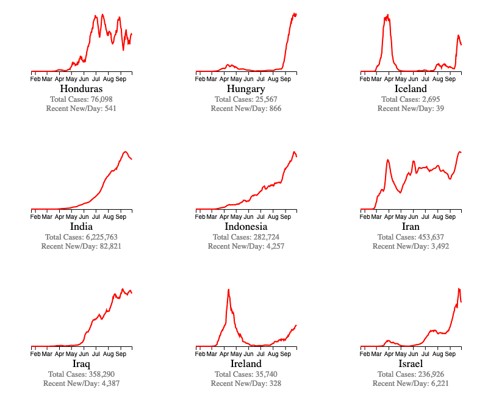

## The present pestilence 🦠

###### Warning: A long read. Read when you have time. ⏳

> Your life matters and uncertainty ❓  _(inevitably)_ is part of the future. 

And since it's been established that we know very little about the implications, it becomes easier to narrow down on the fact that we need to be prudent. 

But just because it is uncertain, doesn't mean that we can't (or shan't) learn to sail through _the unknown waters._ That's the point of being in such waters, isn't it? But then, how can you be both prudent about the unknown _and_ be confident about pursuing the unseen territories? It's the eternal question of humanity in basically!

We learn to ponder the unknowns with what's known. That's what mankind has always done and that's what we are inevitably **good** at. And although we can debate on the evolutionary needs of such ponderings, it becomes imminent that we understand that we are already in the unexplored waters. There's very little point in discussing why we are here, or where this might destroy us than that of trying to hold our fort, learn about how we can handle the current situation. But, of course, it is still important that we understand that looking at why we are here, or where this might destroy us because that forms part of the equation that solves this. 

> "If we can really understand the problem, the answer will come out of it, because _the answer is not separate from the problem._" - Jiddu Krishnamurti

This warrants that we understand the problem in the first place. It's a given that we are in unknown waters. We've heard about these new waters earlier of course. An epidemic, or a pandemic is not new so much so that we have no idea how to behave. _Because we do_. However limited our knowledge may be, we know how to explore the unexplored. Or the least, be prepared. Whether or not we choose to part of this, we are. **And we have to learn the rules of the game to play it well so we can come out of this alive and sane.**

#### This isn't the first global pandemic we're facing
 
Pandemics have existed throughout human history. The black plague, the Spanish flu, the AIDS, or even the dancing plague (which you can read about to understand how _psychogenic_ something like a pandemic could be. And which is far more important than that of the actual known variables (disease, the death, and the loss of human lives) of a plague). You can obviously read about them if you feel like, but what I'm more focused on is the overlaps of all the pandemic situations. We often oversee the effects that events like this have on us. Or at least that's what I wonder about. Of course, one other thing we're impeccable at is to _eventually handle with what's left out._
 
#### This isn't the first of the corona virus strain we've encountered
 
I'm **not** a medical professional. And whoever is reading this, should at least have the ability to search *coronavirus* on google or on Wikipedia and that'll immediately enlighten them about the two other major ones - SARS and MERS. I'll leave it up to you to read up on them if you so wish to. Just know that this isn't the first time we're encountering a strain of this virus. That is to say, if we're patient enough to read an article about a couple of pages it would give us a basic understanding of what the virus is. But of course, people don't - and that's the problem that I want to shine a light on. To ensure that we have a least/minimal information on how to search through to understand the problem. I believe the most plausible thing for us people who aren't medical professional or frontline workers, is to understand what's going on around us. This understanding can help us stay on our feet, and think for ourselves and get the best out of this situation.
 
I need to break a widespread façade in the very beginning. No, the majority of the people who're active on the social media all the time aren't the majority of a nation (Association fallacy) or even the world, if I may take a bit of the liberty to speak for the rest of the world. All things considered, we're all in the same boat. The larger part of the world is run by people who are in fact in pursuing things that they are immediately applicable to. (People closer to them, people impacted by their very surroundings). Those that run the world, (sorry conspiracists) are people just like you and I (in a broader sense of our statures). We're just normal people going on about our daily lives. Fortunately, some of us are very interestingly pursuing things that we are good at. And most of us are good at handling things the way they are - perhaps not inventing or discovering something groundbreaking. But rather, just surviving and ensuring the already existing systems, standards, and ways of our living are not broken about.
 
And when I say that it's people like you and me, I mean it in the broader sense that you and I are timid (_Relatively speaking._ Compared to the frontline workers, or those that don't even have access to the internet, is a lot (and obviously many) more than what we are… but of course, they aren't the ones making it difficult to handle this situation. It's you and I - The ones who have access to a job, uninterrupted internet, food, shelter and access to medical help. We have no idea how gifted we are. But we are still in the middle which isn't a good place to be in, all things considered.)
 
Not many people know about us. Very few do in fact. Our families and friends are the only people who know that we exist. We're not celebrities who are responsible for defining the trends, or scientists solving the next crucial thing for the survivability of the humankind. We're just the normal people who go on about our lives just like every other Tom, Dick, and Harry exploring out existing daily works. Perhaps pondering into the purpose of existence every now and then, but mostly going on about the things that work and figuring out the tiny things that don't. We're engineers and IT professionals that keep the electric grid alive, the networks working, trying to not let the websites go down, enabling TV channels deliver news (whatever true and the fake ones), we're just teachers trying to find a way to educate our students, finding ways to let them utilize the online classes properly and not get distracted. We're the frontline workers trying to wade through the general populace coming into the clinic because they have a common cold, scared and panicked if they would live to see the other day… We're the parents, trying to stay sane in hour homes amidst all the online remote-work/work-from-situation, scared to make enough to pay the bills on time… You get the idea. It's more than what you see on social media where a celebrity stays home but are privileged enough to get everything at a phone-call away. Obviously, it's just way too many people than what we are enabled to see and understand.
 
I'm a software engineer (and specifically, a backend web developer with my current job into the domain of AI). I understand where I stand compared to most of the people and I can sincerely say that it is difficult for me to wade through so much noise online. And if it is difficult for someone like me, I can only imagine that for the rest of the populace in my peer group. So I'm going to try to document what has made me understand the current pestilence. To try to understand the current problem that is plaguing us (no pun intended).

### Understanding the problem.

As an engineer and a _scientific-methodology_ enthusiast, it's slightly easier for me to try to understand the pandemic than many others. And that is by breaking down the problem.
 
Let's go back to the core of the problem - _What it is_ . And please understand that this is how it helped me understand, or see the world going through a difficult time. This is just a curation if you will. I hope it helps you understand as much as it has, for me. But these enabled me to see, understand, and prepare _me_ to explore the unexplored future that is about to knock on our doors.
 
#### Understanding the virus
 
The very first thing that popped up on my mind was what exactly is this. Again, I'm not a medical professional, and my knowledge of the biological component is very limited. So of course, I tried to understand what it is. The following video refreshed my memory on the basic biology of the virus, and slowly gave the basic understanding of the coronavirus.

<iframe width="640" height="480" src="https://www.youtube.com/embed/BtN-goy9VOY" frameborder="0" allow="accelerometer; autoplay; clipboard-write; encrypted-media; gyroscope; picture-in-picture" allowfullscreen></iframe>

 
To those who already know about these guys, I'm glad you know them. To those who don't, here's the gist - They are _incredible_. Follow their channel and have yourself informed of the things that are essential for us to be modern civilized humans.
 
Here's what you gotta understand - This is an _ongoing crisis,_ and we're exploring unknown waters. We strive our best to understand as we encounter things. We don't know if the waters are shallow, covered with icebergs, or even creatures we have no idea about. But even then, these people have made an incredible effort to curate up-to-date information that enabled this video. Please do [check them](https://sites.google.com/view/sourcescorona) out if you need more information.
 
Now, If you've been properly informed about the current pandemic, you would be aware of the John Hopkins University. They are doing impeccable work in trying to understand the situation (on a global scale) than many departments of many nations are striving to. They gave a projection of peak cases in India far too earlier. I'm extremely appalled by the Indian government doing the absolute minimum to even understand the situation. And sure as hell, if they had the least bit of care, they could have seen this coming. But the inadequacy of the governments is something we'll come to later, in the write-up.
 
And now, John Hopkins University, their coverage on the virus is an impeccable one for a better understanding of the situation globally. For the impatient, a bit more technical than the previous video by medical experts is this one. 

<iframe width="640" height="480" src="https://www.youtube.com/embed/oCelMyMtRCk" frameborder="0" allow="accelerometer; autoplay; clipboard-write; encrypted-media; gyroscope; picture-in-picture" allowfullscreen></iframe>

 
 
For the patient ones, as I said earlier, I work in the domain of AI. And someone who is in this domain would have definitely come across Lex Fridman. I am not going to introduce him over here because that requires a separate article by itself. He's a professor at MIT and he's an _incredible human being._ If you surely want to go to the depths of the basics, here's his interaction with a bioinformatics professor Dmitry Korkin discussing the intricacies (Warning: This is quite long and covers much more detailed into different domains.) And for those who are interested in the video's discussions, here's some of the interesting segments mentioned below (Timestamps are mentioned. Trust me, they are quite interesting!)

<iframe width="640" height="480" src="https://www.youtube.com/embed/CwyOUS8TSl0" frameborder="0" allow="accelerometer; autoplay; clipboard-write; encrypted-media; gyroscope; picture-in-picture" allowfullscreen></iframe>

1. Understanding what actually virus is. Virus when seen from the computational viewpoint, is quite fascinating because it's made for almost a singular purpose, and they have evolved to handle that purpose in conditions that are unimaginable. 
		
    - As a developer, it is more relatable to me. Linux enthusiasts understand the power of "simple tools with singular purposes"

2. Engineering a virus - Its far more difficult than what you can imagine. 
   - Every year, we do seasonal flu vaccine. (18:48)
   - 21:21 - More pathogenic a virus is, less contagious it is. But we still don't know if it is biological origin to this property of the virus, and if we don't know that, it's far difficult to engineer a virus. 
   - There's still research going on as to what the proteins on the virus do. (27:55)
   - 29:40 - We have been studying the coronaviruses (The family) for two decades, and we still don't yet know the full capabilities of the proteins. 
   - 40:12 - trying to identify how protein folding can be done is still an open problem. 

3. R0 is not easy to be calculated for a virus which is spreading fast, and at the current crisis. 
   
4. Butterfly effect. (13:01) Remember this, we'll come back to this later.
	
5. 36:30 - We're at the very beginning of this journey, a journey which we have very little idea where it will lead us. 
	
6. 37:03 - Where's biology in understanding viruses.
	
7. 37: 40 - Layers of complexity is just as important to understand just as it is to understand for us to be able to devise a solution. 
	
8. 39:53 on how machine learning can help us advance or even handle a problem as complex as this, 
	
9.  68:32 - It needs nothing but common sense to understand what complications lie in actually understanding the different strains of the viruses. Which has both the positive and the negative aspects to it. 
	
10. Coming to a solution - Vaccine. 
    - 81:09 - Understanding a vaccine
    - 84:01 - Difficulty in creating a vaccine. (Efficient designs and testing within 18 months is already accelerated)
    - Antivirul drugs - 85:54 stop the ciritical function of some proteins. 
    - 91:49 - Mutations and how it might affect us. It is definitely possible that it will mutate and become resistant to our current solution if and when discover it, but when this mutation will happen, and how resistant that might become, is still an open question.  
    - 109:03 - We only have a very basic idea of the differences between a symptomatic and asymptomatic person and their role in the spread of the virus, and thus it becomes a peculiar case and we are overseeing the fact that we are using inefficient ways to contain the virus/spread. 
    - 112:23 Masks don't work to protect us, it works to protect others. (This is how you control the spread) This is motivation that everyone has to wear a mask. 
	
11. 91:26 Possibility of second wave. Which is already happening in many countries across the world. 
    
12. 126:50 - Meaning of life from a computational biologist - A simple tiny thing can reck one of the most difficult species on the face of earth (remember the butterfly effect?) - We are fragile.

#### Understanding the pandemic
 
Understanding the disease is one thing, but what it has caused is a global pandemic and we were not ready for it. I mean, people have been talking about next stage of human transformation for a long time, and one way or the other, the biological component of ours, plays a major role in almost every one of them - Either they are limiting, or whether we have to transmutate them with technologies, or whether it was possible for us to understand and fight for immortality. And when it comes to biology, we inevitably had to come to a discussion of our present state of things - Superbugs, genetic engineering, weaponized biological warfare, and the associated.
 
But looks like we weren't really paying attention to ourselves as much as we should have. And that is why a simple, naturally evolved strain of the common family of viruses is now giving the world a real-life lecture.
 
Of course, people like Bill Gates have been talking about it for a long period of time, and no one bats(no-pun intended) an eye. Here's his TED talk on pandemics. A worthy watch!

<iframe width="640" height="480" src="https://www.youtube.com/embed/6Af6b_wyiwI" frameborder="0" allow="accelerometer; autoplay; clipboard-write; encrypted-media; gyroscope; picture-in-picture" allowfullscreen></iframe>

 
I have not been a fan of Microsoft for a long time, (Hey, I'm a dev! 😜) but lately, it seems like they are doing some impressive work. It's something that I believe most of us misunderstand - Just because we didn't like someone or something, doesn't mean it is going to stay the same. And just because something useful comes from someone we hate/disagree with, doesn't mean we shouldn’t pay attention to them. And thankfully, I have had time to take a step back and observe what it is that Microsoft is doing, and Bill Gates, outside of whatever is propagated. And I should say, I am quite impressed and so should other people. 
 
But then, as you can see, the video was really old. Had we paid enough attention, we would have things in place to keep such a pandemic in check. But we did not, and now that's spilt milk under the bridge. But of course, he didn't get disappointed with the fact that people, scientists, and those who have had the power to have made change didn't heed to him. He went onto what is possible with what we have now and started doing the best he can to understand and contribute to putting the pandemic in check. So of course he came forward and gave an impressive clarity on what we can and should be doing. 

<iframe width="640" height="480" src="https://www.youtube.com/embed/Xe8fIjxicoo" frameborder="0" allow="accelerometer; autoplay; clipboard-write; encrypted-media; gyroscope; picture-in-picture" allowfullscreen></iframe>

 
And of course, he did a lot of reading just like how most of the world should have done, at least the ones with access to the biggest resource the humanity has ever come up with - Internet. But that's what the difficulty is about, it is not easy to wade through so much noise for someone who is not careful enough. Way too much pollution floating around than anything else we have seen. I don't believe it's the earth that needs our first attention as to how we can clear the land, water, air, and noise pollution. The very imminent pollution we need to clear is information pollution. Because unlike the other ones, this one is very powerful enough to pollute the other ones with just a tap of a button (Outside the scope of this chapter)
So he did wade through some unnecessary BS floating around, and got on with the useful one - Research, Understand, Do what you can to make the world a better place. He wrote about the pandemic situation over [here](https://www.gatesnotes.com/Health/Pandemic-Innovation?WT.mc_id=20200423090000_Pandemic-Innovation_BG-LI_&WT.tsrc=BGLI).

#### The 'pan' in the pandemic
 
How the world responded (and is responding) to the pandemics is of very high interest. Everyone had their understanding of what the disease is, and how it spread. And that's the tricky part. Every country was sure theirs worked, and others' didn't. And that caused a lot of confusion. Even extraordinary conspiracy theories such as the "plandemic". But why didn't we just for once learnt to look at it from a wider perspective? If not the whole wide world, when will be able to widen our perspective at all? Each of them has their understanding and each of them has their truths to it. The different geographical region has a different set of constraints. People are different, their immunity is different, and our interaction(Both biologically and metaphorically) with a not-so-clearly understood virus is different.
 
Reality(that we experience, not the actual reality) is not strict. Especially when it is global. The virus mutates, and it evolves. And if that is the case, why is it hard to understand that our understanding of the same mutates and evolves too? We're smack in the middle of an ongoing threat. We have neither a clear picture of the problem nor a solid, viable, large-scale solution. People thinking that the govt. is rapidly changing their viewpoints on the situation because they have no control over the same is not just arrogant and idiotic, but it is also costing us lives. And as unfortunate as it seems, it is only going to cost us more.
 
#### Acknowledging our misunderstandings
 
Before we jump into how the countries handled this unforeseen (I highly doubt that personally, but the major consensus is held otherwise from the scientific community) it is important for us to understand how this panned out - The timeline of the pandemic is something that we could pay a lot more attention to. Given that the spread is what's causing more ruckus than the actual fatality of the virus. And as I always used to say, it's important to look at both the external (global) and internal (local) scales of the spreads.
 
If you are willing to spend any amount of time to understand the whole fiasco of Covid-19 pandemic, you're required to understand how we have sailed the water till now. It is of paramount importance to understand any "ongoing" threat/situation. (Your distant uncle/aunt getting tired of "frequently changing government rules and regulations" is not proof of their paranoia that this is a worldwide scam)
 
[Here's](https://www.who.int/emergencies/diseases/novel-coronavirus-2019/interactive-timeline#!) a timeline of the pandemic so far. (I'm not a fan of WHO due to a lot of reasons, but that shouldn't stop me from accepting their good works now and then). Please take your time to scroll through the _visual_ timeline. It'll help you understand how complicated this whole situation is. It's not as easy to eradicate something that you don't understand in the first place. And it is important to understand that the experts are trying to do everything at their disposal to analyse and mitigate the situation. 

#### How countries handled this situation
 
This is tricky, and this is where I'm personally angered at a lot of things. A lot of countries handled this situation in a lot of ways. (I'm from India, by the way). And it varies on so many scales. What's quite concerning is that one set of people from one geographical region, with a different economic condition and healthcare facilities scrutinizing the others. This goes on around and about and it's not helpful. A couple of things to consider,

- Different countries have a different set of reactions and interactions to the virus. (Biological component is massive, it's a virus for the pandemic's sake!)
- The economic conditions vary widely - Can't bucket into developed/developing nations. More variables come into play. 
- The political ideologies are very different between nations. Some are tightly knit, others not so much. 
- The spiritual ideologies are increasingly polarizing. Some demographies don't even have it. 
- The medicinal receptivity and responsivity varies widely between nations and cultures within the nations (eg: for a country like India, this is massive. Again, this is a biological component)
- The natural immune response with respect to their climate regions (Eg: Tropical countries and their receptivity to flu/respiratory conditions)
- Population, and the percentage of the population that are daily wage workers (A great example is India)
- Healthcare methodologies, resources, medical professionals, and committees handling them, hospitals and their availability of equipment are very different even within a part of a nation. 
- And finally, (but of great significance) the psychological resilience of people defined to a culture/region to threats of such scale. 

As you can imagine, there's more to it than what we can fathom. Collaboration is of massive significance rather than questioning each other. Sure I can bash and accuse the Indian government for running one of the largest herd-immunity experiment in the history of mankind (while the pandemic itself being the first in the history of mankind) but that isn't going to help me or the others. It has more complications than that of what I can try to curate over here, and I shouldn't ponder over the questions that I have no control over. At moments like this, I strongly believe a Stoic standpoint is of utmost importance. By doing whatever I can to help the situation rather than complicating it.
 
Having said that, the collaborative efforts of people are just incredibly massive. I'm proud to say that I'm part of the tech community that made this global-scale collaboration possible. There are so many efforts that it'll need its page on this book to discuss it, but keeping it short, here are a couple of efforts you need to pay attention to.

- [End Coronavirus](https://www.endcoronavirus.org/) is a beautiful and impressive effort to mitigate/inform people/leaders to take a look at examples of other nations who beat the situation and those who didn't. It helps with the above questions - To replicate what worked for some nations and understanding them instead of simply trying to simulate their results. 

  

- I'm appalled at how the Indian govt. is handling the situation (which is only marginally acceptable, people would beg to differ though, towards the cons side of this) and the govt information propagation regarding this situation and the health crisis is worse than poor. But thankfully, a group of individuals took it upon themselves to create [an open, collaborative effort to curate the information](https://www.covid19india.org/) from various departments from various states and gave it in a modern, 21st-century informative website. Please, go ahead and read their "about" page. 
    - But then, of course, we should laud certain things that the govt. managed to do properly - like the example of Kerala's tackling of the situation which was well received by nations of the world (just not Indian politicians, I believe)
- I can't even start to describe how immensely we should be thankful for sites/contributors like [Our World In data](https://ourworldindata.org/coronavirus) who have been releasing pretty much everything for the whole of humanity. Please do take a look at their curation on COVID situation. 
- Some nations have managed to thwart this situation - primarily by focusing just on the problem and by properly prioritizing the other problems that were caused by the pandemic. That is, by prioritizing health over economical conditions for instance. (Economy can regenerate far quicker than any nation's healthy populace). New Zealand for one tackled this quite impressively. You can read more about some associated news over [here](https://www.npr.org/sections/goatsandsoda/2020/05/23/861577367/messaging-from-leaders-who-have-tamed-their-countrys-coronavirus-outbreaks)
- Just so you know, I'm not even gonna start with the condition over at the U.S. because that's a league I'm not ready to spend time on. Moreover, like I've been writing about, it is a whole different situation over there, and I can't comment on it yet because it's far too messy at this point. 
- Some nations though took this peculiar state we are in and were able to handle the situation better than most others. Of course, it isn't necessarily easy or simple for other countries due to various reasons as already mentioned (Population, healthcare facilities, natural immune response based on culture and lifestyle, etc) but it is quite interesting how some countries have handled it, and it becomes increasingly important to learn from them. Some even managed to mitigate economic issues. Learning from the success and failures of strategies to keep this pandemic in check might help us keep the ensuing second/future waves of the mutations as seen in other countries

<blockquote class="instagram-media" data-instgrm-captioned data-instgrm-permalink="https://www.instagram.com/p/CEKf1l5gDKz/?utm_source=ig_embed&amp;utm_campaign=loading" data-instgrm-version="12" style=" background:#FFF; border:0; border-radius:3px; box-shadow:0 0 1px 0 rgba(0,0,0,0.5),0 1px 10px 0 rgba(0,0,0,0.15); margin: 1px; max-width:540px; min-width:326px; padding:0; width:99.375%; width:-webkit-calc(100% - 2px); width:calc(100% - 2px);">
 <a href="https://www.instagram.com/p/CEKf1l5gDKz/?utm_source=ig_embed&amp;utm_campaign=loading" style=" background:#FFFFFF; line-height:0; padding:0 0; text-align:center; text-decoration:none; width:100%;" target="_blank"> 
 

 
 

 

 
<svg width="50px" height="50px" viewBox="0 0 60 60" version="1.1" xmlns="https://www.w3.org/2000/svg" xmlns:xlink="https://www.w3.org/1999/xlink"><g stroke="none" stroke-width="1" fill="none" fill-rule="evenodd"><g transform="translate(-511.000000, -20.000000)" fill="#000000"><g><path d="M556.869,30.41 C554.814,30.41 553.148,32.076 553.148,34.131 C553.148,36.186 554.814,37.852 556.869,37.852 C558.924,37.852 560.59,36.186 560.59,34.131 C560.59,32.076 558.924,30.41 556.869,30.41 M541,60.657 C535.114,60.657 530.342,55.887 530.342,50 C530.342,44.114 535.114,39.342 541,39.342 C546.887,39.342 551.658,44.114 551.658,50 C551.658,55.887 546.887,60.657 541,60.657 M541,33.886 C532.1,33.886 524.886,41.1 524.886,50 C524.886,58.899 532.1,66.113 541,66.113 C549.9,66.113 557.115,58.899 557.115,50 C557.115,41.1 549.9,33.886 541,33.886 M565.378,62.101 C565.244,65.022 564.756,66.606 564.346,67.663 C563.803,69.06 563.154,70.057 562.106,71.106 C561.058,72.155 560.06,72.803 558.662,73.347 C557.607,73.757 556.021,74.244 553.102,74.378 C549.944,74.521 548.997,74.552 541,74.552 C533.003,74.552 532.056,74.521 528.898,74.378 C525.979,74.244 524.393,73.757 523.338,73.347 C521.94,72.803 520.942,72.155 519.894,71.106 C518.846,70.057 518.197,69.06 517.654,67.663 C517.244,66.606 516.755,65.022 516.623,62.101 C516.479,58.943 516.448,57.996 516.448,50 C516.448,42.003 516.479,41.056 516.623,37.899 C516.755,34.978 517.244,33.391 517.654,32.338 C518.197,30.938 518.846,29.942 519.894,28.894 C520.942,27.846 521.94,27.196 523.338,26.654 C524.393,26.244 525.979,25.756 528.898,25.623 C532.057,25.479 533.004,25.448 541,25.448 C548.997,25.448 549.943,25.479 553.102,25.623 C556.021,25.756 557.607,26.244 558.662,26.654 C560.06,27.196 561.058,27.846 562.106,28.894 C563.154,29.942 563.803,30.938 564.346,32.338 C564.756,33.391 565.244,34.978 565.378,37.899 C565.522,41.056 565.552,42.003 565.552,50 C565.552,57.996 565.522,58.943 565.378,62.101 M570.82,37.631 C570.674,34.438 570.167,32.258 569.425,30.349 C568.659,28.377 567.633,26.702 565.965,25.035 C564.297,23.368 562.623,22.342 560.652,21.575 C558.743,20.834 556.562,20.326 553.369,20.18 C550.169,20.033 549.148,20 541,20 C532.853,20 531.831,20.033 528.631,20.18 C525.438,20.326 523.257,20.834 521.349,21.575 C519.376,22.342 517.703,23.368 516.035,25.035 C514.368,26.702 513.342,28.377 512.574,30.349 C511.834,32.258 511.326,34.438 511.181,37.631 C511.035,40.831 511,41.851 511,50 C511,58.147 511.035,59.17 511.181,62.369 C511.326,65.562 511.834,67.743 512.574,69.651 C513.342,71.625 514.368,73.296 516.035,74.965 C517.703,76.634 519.376,77.658 521.349,78.425 C523.257,79.167 525.438,79.673 528.631,79.82 C531.831,79.965 532.853,80.001 541,80.001 C549.148,80.001 550.169,79.965 553.369,79.82 C556.562,79.673 558.743,79.167 560.652,78.425 C562.623,77.658 564.297,76.634 565.965,74.965 C567.633,73.296 568.659,71.625 569.425,69.651 C570.167,67.743 570.674,65.562 570.82,62.369 C570.966,59.17 571,58.147 571,50 C571,41.851 570.966,40.831 570.82,37.631"></path></g></g></g></svg>

 
 View this post on Instagram

 

 

 

 

 

 

 

 

 

</a> 
 <a href="https://www.instagram.com/p/CEKf1l5gDKz/?utm_source=ig_embed&amp;utm_campaign=loading" style=" color:#000; font-family:Arial,sans-serif; font-size:14px; font-style:normal; font-weight:normal; line-height:17px; text-decoration:none; word-wrap:break-word;" target="_blank">Coronavirus infections are surging again across much of Europe and governments are racing to prevent a full-fledged second wave of the pandemic —without resorting to the kind of broad lockdowns that devastated their economies in the spring.⠀ ⠀ The seven-day rolling average of reported new daily cases has more than doubled since the end of July in the five largest European countries, nearing 11,000. That is the biggest sustained rise on the continent since it beat back the virus’s initial spike in March and April.⠀ ⠀ Outbreaks are multiplying around vacation hot spots, shopping centers, parties and some workplaces. Authorities are also reporting that many cases have no known origin, undermining efforts to use contact tracing to contain the virus and indicating relatively wide community spread.⠀ ⠀ The problem is particularly acute in Spain, where around 4,800 new cases a day were detected on average over the week ending Aug. 17, more than at any point since April. In neighboring France, new daily coronavirus infections surged roughly 50% in the week ending Aug. 17, compared with the prior week, averaging around 2,400 a day and reaching their highest levels since the country emerged from lockdown in May.⠀ ⠀ Read more at the link in our bio.</a>
 
A post shared by <a href="https://www.instagram.com/wsj/?utm_source=ig_embed&amp;utm_campaign=loading" style=" color:#c9c8cd; font-family:Arial,sans-serif; font-size:14px; font-style:normal; font-weight:normal; line-height:17px;" target="_blank"> The Wall Street Journal</a> (@wsj) on <time style=" font-family:Arial,sans-serif; font-size:14px; line-height:17px;" datetime="2020-08-21T20:01:39+00:00">Aug 21, 2020 at 1:01pm PDT</time>

</blockquote> 

#### What we should be careful about
 
So yea, some nations and their politicians did not focus on the unknowns of the virus and create a panic situation but played to their strengths of what was known. But the public laymen can't really understand many of these. Especially given that it's become fancy to showcase "charts and dashboards". (As someone who's been working on AI and Analytics on the professional front, I have been growing quite irritated about this, but it is what it is. Humans are more visually receptive than analytically) And why is understanding this important you ask?
 
> "There are three kinds of lies: lies, damned lies, and _statistics._" ~ _Anonymous_
 
The importance of looking at statistical information is of paramount importance in situations like this. Vox Media has nailed this one on explaining why charts can be misleading for the general populace.

<iframe width="640" height="480" src="https://www.youtube.com/embed/O-3Mlj3MQ_Q" frameborder="0" allow="accelerometer; autoplay; clipboard-write; encrypted-media; gyroscope; picture-in-picture" allowfullscreen></iframe>

 
But, like everything else, it's just a tool. It can be very helpful to make "data-driven-decisions" but at the same time, overly relying only on those isn't gonna help us go anywhere. Especially where we want to go. Those who know why predicting on the meteorological data is difficult, can understand the tip of the iceberg of what I'm trying to convey here. Remember, we're still in unknown waters, and we have so many unknown variables.
 
People thinking that it'll fade away aren't aware of the recurrence of the situation, or even about the "waves" of mutated situations. For instance, consider the Rt value of the virus. It's ever-changing on an ongoing crisis because we are still collecting data. Maybe [take a look](https://rt.live) at how the virus's spreads in different regions with different rules and regulations with respect to the pandemic. 

if you've taken a look at the above information, visual representations of the present state across various nations are very vivid. Where we are heading, we don't really have as much control over the panic. Now that the months long lockdowns are being taken down (especially in India, where the first wave hasn't been over) we are going to face some sharp peaks. But of course, herd immunity is going to help us (specifically in south asian-countries, but that's out of our hands really.) 

As an engineer in this particular domain(AI), **3Blue1Brown** is an incredible channel that explains the mathematics of our domain. And here's his visual representation of social distancing (by simulating an epidemic) and which was lauded by many doctors(epistemologists), mathematicians, and scientists of the academic community. If anything, I urge you to watch this in its full glory. 

<iframe width="640" height="480" src="https://www.youtube.com/embed/gxAaO2rsdIs" frameborder="0" allow="accelerometer; autoplay; clipboard-write; encrypted-media; gyroscope; picture-in-picture" allowfullscreen></iframe>

Having said that, some more links on certain important things we need to pay attention to:
- Contact tracing has been in place in a lot of countries, (India, Aarogya Setu App). However, it should be noted that it might be quite unreliable with an ongoing, mutating situation like the current pandemic. More [here](https://www.economist.com/leaders/2020/05/16/dont-rely-on-contact-tracing-apps). 
- It's been said time and time again about the importance of [testing](https://vben.at/event/way-out-of-corona-why-testing-matters/) which was not really handled properly in a lot of countries. (Including India till at least July) We should also note that testing isn't reliable yet. You can read more about that [here](https://www.nationalgeographic.com/science/2020/05/why-unreliable-tests-are-flooding-the-coronavirus-conversation-cvd/?cmpid=org=ngp::mc=social::src=twitter::cmp=editorial::add=tw20200506science-flawedantibodytestingcoronavirus::rid=&sf233686647=1). And even the new/recent trial of using dogs to sniff the infected is currently being tested. 
- Lockdown has been half of the year 2020 in most of the world. However, it is (has been) quite useless in a lot of countries. Especially in a country like India. More [here](https://www.cnbc.com/2020/05/06/ny-gov-cuomo-says-its-shocking-most-new-coronavirus-hospitalizations-are-people-staying-home.html).  Also, as I said, the cultural, and geographical importance plays a massive role in [low numbers](https://theprint.in/health/why-south-asia-has-20-of-worlds-population-but-less-than-2-of-covid-19-cases/408471/) (apart from the govts. tampering with it)

The primary impact has been, to an extent, visible to us till now. That is quite possibly why I was able to curate so much to this. However, there are secondary implications associated with this situation which could be very difficult to handle because we don't even know the problem in the first place. (Take the long term effects of the disease even if people are "recovered" from covid! It's horrible in a lot of ways)
 
The lives of people have been completely tampered with, with the advent of this pandemic. The everyday life of people had to have a massive shift. I'll speak for myself as an example. Working in the technology (or IT) industry in a country like India has brought to light a lot of BS. People can talk all about "working from home" is a gift (or the opposite) but realize that we are not working from home. We are working at home amidst a pandemic. I repeat, _WORKING AMIDST A PANDEMIC._ For heaven's sake, it's not the same!

- Massive layoffs are in place, (and some employers/MNCs are extorting employees for far more hours than usual - One that is typical to nations like India)
    - Their employee's mental health isn't being looked into. And we don't even know of the cost that this is having on their families. Psychiatrists would agree with me. 
    - The recent "video-conference" fatigue isn't a joke. It is [real](https://theconversation.com/zoom-fatigue-how-to-make-video-calls-less-tiring-137861), and it has psychological costs to it. 
- The unemployment rate is now at an [all time high](https://www.weforum.org/agenda/2020/05/coronavirus-unemployment-jobs-work-impact-g7-pandemic/).   
- Schools and colleges had to take a massive shift in the way they work. Despite being a fan of homeschooling, I understand the importance of socializing at a young age. 
    - Both teachers and parents are suffering in ways we have no clue about. 
    - Of course, students may not necessarily realize the impact that this is having because let's be real, I'm writing the whole chapter because adults didn't get it in the first place! 
- This situation likely has a massive impact on the logistical and the psychopolitical/sociological aspects of some of the common utilitarian industries (Power, Healthcare, Regional, Education, Manufacturing, Entertainment, etc) and some complicated industries (Such as technology, research, and military)

The above is just a sliver of the pie that is of the massive implications of the situation. If you think that this isn't as important as I'm trying to portray here, feel free to read about how [this economic impact](https://en.wikipedia.org/wiki/Economic_impact_of_the_COVID-19_pandemic?oldformat=true) is far worse than the 2008 financial crisis.

#### What we don't know
 
As I've been trying to convey, it is quite a difficult feat to be biologically fully understanding of the virus for us to come up with a complete cure or vaccination immediately. You can look at it this way - We're trying to solve a jigsaw puzzle while we don't even have all the pieces and we are discovering a piece now and then. And while we go search for the rest of the pieces, the existing pieces reshape themselves, and add to it you don't see the same image on the puzzle as another person. Now, please be aware I'm extremely oversimplifying this, and there's more to it obviously. (I'm just an engineer!) Having said that, we are still hunting a solution as we discover more information about the puzzle that is the virus. Here are a couple of things you might be interested in, pertaining to the medical feasibility of the vaccination or a cure.
 
- Once again, I'm utilizing [Gates' notes](https://www.gatesnotes.com/Health/What-you-need-to-know-about-the-COVID-19-vaccine?WT.mc_id=20200430165006_COVID-19-vaccine_BG-LI&WT.tsrc=BGLI&linkId=87665528) on what it takes to create a vaccine and how complicated it is. 
- And the whole world is rushing for a vaccine, which inevitably became a competitive environment, because obviously whoever comes up with a vaccine holds power over other nations on various fronts. (I highly doubt this will be another penicillin story). 
  

  <iframe width="640" height="480" src="https://www.youtube.com/embed/3I1Wk9SIZ5Q" frameborder="0" allow="accelerometer; autoplay; clipboard-write; encrypted-media; gyroscope; picture-in-picture" allowfullscreen></iframe>
  

- Here's a timeline of a possible vaccine in the coming months. 
  

  <iframe width="640" height="480" src="https://www.youtube.com/embed/j_8CINyQAVI" frameborder="0" allow="accelerometer; autoplay; clipboard-write; encrypted-media; gyroscope; picture-in-picture" allowfullscreen></iframe>
  
 
- Added to that, we have more psychological impacts than physical ailments, which is unforeseen because people are not really immune to psychological battles. The [psychological impact](https://www.psychiatrictimes.com/view/panic-and-pandemics-return-absurd) of a pandemic
    - If you didn't notice it on the article above, I can't recommend enough The Plague by Albert Camus. Please, if you have the time, read that novel. It's worth it. (From one of my favourite philosophers)
- COVID, as such is not something that we can eradicate at a single stretch. If you’ve read the gates' notes on the complications of the vaccine, you would have also come across how difficult it is to be distributed to the populace. And it isn't even straightforward. Even the disease as such [isn't going to go away](https://www.theguardian.com/world/2020/may/14/global-report-who-says-covid-19-may-never-go-and-warns-of-mental-health-crisis ). It took us decades to get rid of smallpox and anthrax. 
- Another interesting read on the psychological impact of what we are going through. Dreams during the pandemic!
  

  <blockquote class="instagram-media" data-instgrm-captioned data-instgrm-permalink="https://www.instagram.com/tv/CAId-yqlC8O/?utm_source=ig_embed&amp;utm_campaign=loading" data-instgrm-version="12" style=" background:#FFF; border:0; border-radius:3px; box-shadow:0 0 1px 0 rgba(0,0,0,0.5),0 1px 10px 0 rgba(0,0,0,0.15); margin: 1px; max-width:540px; min-width:326px; padding:0; width:99.375%; width:-webkit-calc(100% - 2px); width:calc(100% - 2px);">
 <a href="https://www.instagram.com/tv/CAId-yqlC8O/?utm_source=ig_embed&amp;utm_campaign=loading" style=" background:#FFFFFF; line-height:0; padding:0 0; text-align:center; text-decoration:none; width:100%;" target="_blank"> 
 

 
 

 

 
<svg width="50px" height="50px" viewBox="0 0 60 60" version="1.1" xmlns="https://www.w3.org/2000/svg" xmlns:xlink="https://www.w3.org/1999/xlink"><g stroke="none" stroke-width="1" fill="none" fill-rule="evenodd"><g transform="translate(-511.000000, -20.000000)" fill="#000000"><g><path d="M556.869,30.41 C554.814,30.41 553.148,32.076 553.148,34.131 C553.148,36.186 554.814,37.852 556.869,37.852 C558.924,37.852 560.59,36.186 560.59,34.131 C560.59,32.076 558.924,30.41 556.869,30.41 M541,60.657 C535.114,60.657 530.342,55.887 530.342,50 C530.342,44.114 535.114,39.342 541,39.342 C546.887,39.342 551.658,44.114 551.658,50 C551.658,55.887 546.887,60.657 541,60.657 M541,33.886 C532.1,33.886 524.886,41.1 524.886,50 C524.886,58.899 532.1,66.113 541,66.113 C549.9,66.113 557.115,58.899 557.115,50 C557.115,41.1 549.9,33.886 541,33.886 M565.378,62.101 C565.244,65.022 564.756,66.606 564.346,67.663 C563.803,69.06 563.154,70.057 562.106,71.106 C561.058,72.155 560.06,72.803 558.662,73.347 C557.607,73.757 556.021,74.244 553.102,74.378 C549.944,74.521 548.997,74.552 541,74.552 C533.003,74.552 532.056,74.521 528.898,74.378 C525.979,74.244 524.393,73.757 523.338,73.347 C521.94,72.803 520.942,72.155 519.894,71.106 C518.846,70.057 518.197,69.06 517.654,67.663 C517.244,66.606 516.755,65.022 516.623,62.101 C516.479,58.943 516.448,57.996 516.448,50 C516.448,42.003 516.479,41.056 516.623,37.899 C516.755,34.978 517.244,33.391 517.654,32.338 C518.197,30.938 518.846,29.942 519.894,28.894 C520.942,27.846 521.94,27.196 523.338,26.654 C524.393,26.244 525.979,25.756 528.898,25.623 C532.057,25.479 533.004,25.448 541,25.448 C548.997,25.448 549.943,25.479 553.102,25.623 C556.021,25.756 557.607,26.244 558.662,26.654 C560.06,27.196 561.058,27.846 562.106,28.894 C563.154,29.942 563.803,30.938 564.346,32.338 C564.756,33.391 565.244,34.978 565.378,37.899 C565.522,41.056 565.552,42.003 565.552,50 C565.552,57.996 565.522,58.943 565.378,62.101 M570.82,37.631 C570.674,34.438 570.167,32.258 569.425,30.349 C568.659,28.377 567.633,26.702 565.965,25.035 C564.297,23.368 562.623,22.342 560.652,21.575 C558.743,20.834 556.562,20.326 553.369,20.18 C550.169,20.033 549.148,20 541,20 C532.853,20 531.831,20.033 528.631,20.18 C525.438,20.326 523.257,20.834 521.349,21.575 C519.376,22.342 517.703,23.368 516.035,25.035 C514.368,26.702 513.342,28.377 512.574,30.349 C511.834,32.258 511.326,34.438 511.181,37.631 C511.035,40.831 511,41.851 511,50 C511,58.147 511.035,59.17 511.181,62.369 C511.326,65.562 511.834,67.743 512.574,69.651 C513.342,71.625 514.368,73.296 516.035,74.965 C517.703,76.634 519.376,77.658 521.349,78.425 C523.257,79.167 525.438,79.673 528.631,79.82 C531.831,79.965 532.853,80.001 541,80.001 C549.148,80.001 550.169,79.965 553.369,79.82 C556.562,79.673 558.743,79.167 560.652,78.425 C562.623,77.658 564.297,76.634 565.965,74.965 C567.633,73.296 568.659,71.625 569.425,69.651 C570.167,67.743 570.674,65.562 570.82,62.369 C570.966,59.17 571,58.147 571,50 C571,41.851 570.966,40.831 570.82,37.631"></path></g></g></g></svg>

 
 View this post on Instagram

 

 

 

 

 

 

 

 

 

</a> 
 <a href="https://www.instagram.com/tv/CAId-yqlC8O/?utm_source=ig_embed&amp;utm_campaign=loading" style=" color:#000; font-family:Arial,sans-serif; font-size:14px; font-style:normal; font-weight:normal; line-height:17px; text-decoration:none; word-wrap:break-word;" target="_blank">We spoke with Dr. Deirdre Barrett, an Assistant Professor of Psychology at Harvard, to find out why your dreams might be more vivid than usual during the pandemic</a>
 
A post shared by <a href="https://www.instagram.com/seeker/?utm_source=ig_embed&amp;utm_campaign=loading" style=" color:#c9c8cd; font-family:Arial,sans-serif; font-size:14px; font-style:normal; font-weight:normal; line-height:17px;" target="_blank"> Seeker</a> (@seeker) on <time style=" font-family:Arial,sans-serif; font-size:14px; line-height:17px;" datetime="2020-05-13T15:01:57+00:00">May 13, 2020 at 8:01am PDT</time>

</blockquote> 
  
 
- The psychological impact is quite heavy, and which I've been trying to read more about. One of the easiest things for us to miss out on are the secondary implications caused by this virus, and the Pandemic. (Virus and disease being the medical side, while the pandemic pertains to much [more](https://www.facebook.com/notes/daniel-schmachtenberger/mind-viruses-during-a-pandemic/10156663879545213/))
 
Having talked about the problem and the solution and what we'll have to look forward to, you know what's more difficult to fight than the virus? The misinformation pandemic. I've written plenty about the polarization of the people and their ideologies, and we're amidst a growing population of people who are well educated, but unable to see through the intricately interwoven conspiracies that we spin ourselves in. I gotta admit though, it's becoming more difficult than ever to actually separate valid information from the invalid one because… because we're wired towards negativity([Negativity bias](https://www.facebook.com/roman.sheremeta.7/posts/10157474931952549)) more than positive information. It's essential to us in an evolutionary sense.
 
The reason as to why it is increasingly getting difficult in fighting off the useless weed is of evolutionary one, and it shall only get worse. For every good/valuable information that we have, we have a piece of supporting evidence on the same which is supported by another. And that happens with the bad/useless information as well. And we have to expend more energy and time and resources to devalue a false claim and accusation. And an impressive example of this is that more people today believe that we didn't land on the moon yet, or that the earth is flat. How is that even possible? And let's face it if you have to prove these people otherwise, is not easy by any stretch. People today wield a lot more power when it comes to their "opinions" and words, which they inevitably use it in polarizing ways.
 
And concerning COVID, which is an "ongoing" and [ever-mutating](https://theconversation.com/coronavirus-mutations-what-weve-learned-so-far-145864) (both the viral strain and the regulations surrounding its eradication) situation is without question being put into such scrutiny by people who would otherwise be called intelligent and brilliant humans and individuals. (You know of the people I'm talking about). If you're like me, you would have already come across the "documentary" called "Plandemic". I have nothing more to say about that. That is a spot-on example of what I'm trying to convey here. It is directed in such a way that people would easily believe something like that if they're not being careful and conscious about it. It's another pandemic we aren't looking at, and which needs more discussion to be handled and kept in check. Here's a gist as to how we can fight such conspiracies or at least be careful about their consumption. We need to learn [how to combat conspiracy theories](atlasgeographica.com/coronavirus-and-conspiracies-the-role-of-the-enemy/?fbclid=IwAR2tJVRcS4OzP4zbQR8yKyAJ0bXnFf4NOcLu4k4q7r2825nTc7S3AICcgM8) at times of crisis. 

#### In summary...

All of this has multitude of facets on what it has to convey and sometimes it could help convey things that weren't really intended. (It did give me a lot of insights as I was writing it over months, really). The least it is supposed to establish is that this pandemic, (not the corona as a virus) has changed the very fabric of our modern society. So to those who have read the whole of the article, (which is a feat in itself) would have already connected the dots. But if you're one to get overwhelmed by tangential thoughts cropping up from everything that was discussed on this page, here's the gist. 

Remember [Maslow's hierarchy of needs](https://www.wikiwand.com/en/Maslow%27s_hierarchy_of_needs)? It's one of those basic understanding of humans as a civilization and society, and that covers quite a lot of generalized (and philosophical views) of humans. If you're still wondering, here's a puzzle. Take a look at the following pyramid of human necessities. And think about one segment that you think is completely untouched by this pandemic. 

And if you noticed the bottom/foundation of the hierarchy being in a lot of difficulties, you'll realize the top is bound to topple. And we're already seeing it manifesting in ways we have no idea how to correlate yet(the protests all over the world over things that really shouldn't happen, and the ridiculous number of people being swayed away from science in general). And in all honesty, it is going to only snowball. We're on the verge of long-term effects, and we should be careful. 

##### Some interesting links

- [Masks work](https://www.youtube.com/watch?v=eAdanPfQdCA&feature=youtu.be). 
- Face masks are important to handle [the second wave](https://www.sciencefocus.com/news/face-mask-use-needed-to-prevent-covid-19-second-wave/).
- Second wave in [Europe](https://www.wsj.com/articles/covid-19-appeared-to-be-under-control-in-europe-now-its-surging-again-11597848444)
- How the coronavirus kills - A very interesting, interactive page that discusses [the progression](https://www.sciencemag.org/news/2020/04/how-does-coronavirus-kill-clinicians-trace-ferocious-rampage-through-body-brain-toes) of the disease's fatality.  
- If you know me, you'd know I talk much about symbolism. Because, for the greater or worse part of our civilizations are driven by symbols. (As an AI engineer, I can understand them contributing to our 'judgments' because they have weights that are higher than the others due to reinforcement). And a pandemic has their own [symbolic meaning](https://thesymbolicworld.com/articles/coronavirus-the-symbolism-of-epidemics-transcript/) which is unraveling. 

---

#### References, footnotes, and credits

##### 1. Quote attribution
###### Although often wrongly attributed to Benjamin Disraeli, it was popularised by one of my favourite authors - Mark Twain. If you find it interesting, please, [read more](https://en.wikipedia.org/wiki/Lies,_damned_lies,_and_statistics?oldformat=true) about it.
##### 2. Maslow's hierarchy of needs attributed to well... Maslow and [the creator of the image] (https://commons.wikimedia.org/wiki/File:Maslow%27s_Hierarchy_of_Needs_Pyramid.png). 
