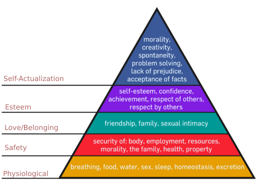

# We don't comprehend it yet!

#### Covid19 from the eyes of an engineer
Being a developer in a country like India has it's own set of idiosyncracies that when said out loud will only make developers from a well-developed nation frown. We have our stereotypical stature among the western world where everything is looked from the silicon valley perspective. But ofcourse, memes crop up everywhere about Indian developers creating tutorial videos all over the place in this technological landscape.

For the millenial generation of people in India, it's one of the two options when growing up and choosing our studies: An Engineer or a Doctor. 

Now, being an engineer myself, there's nothing wrong about the fact that our previous generation thought about the notion that only being an engineer or a doctor is respectable enough in a country that takes the caste system very seriously. (*A topic of an epidemic for another day*). Their intentions were, for the greater part, genuine, just not morally right perhaps. 

> _After all, being genuine has nothing to do with being morally right!_

It's the clichéd rat race over here. Whether people admit to the involuntary race or not, they sure are a participant. We all are. We all fight over the tiniest of things. Any college graduate; a millenial, is going to be an engineer (or a doctor) or be part of this race. This technological landscape in India is nothing new. It's been going on for years now. And very few are even aware of the impact it is causing. Enterprises are scooping up young people from colleges, train them (Or in a better term - drain them (off their creative, and curious juices)) and make them run the race. 

Of course, This isn't about this race - It's about the pandemic. But what good is talking about the pandemic if you don't know how the lives of the greater part of the nation that is unknowingly playing the part of the pandemic that's infact really worse than the Covid-19 situation? I'll try and narrate a chronological version of my *understanding* of the events that will eventually enable me among most to understand this better. 

### A normal day, that really wasn't as normal as was intended to be.

For me, it was rather a busy day. I was entrenched in work that day prior to knowing about the national curfew (for a day). A test run. I did not have the time to wade through the stupidities ()[] of the news/media to come to a sane, unbiased conclusion about what was ensuing in the coming days: A nation-wide lockdown. The biggest, second(?) mostly populated democracy (3)[] in the world was about to go into a complete lockdown. 

I was at that time, at my brother's place. Nothing seemed off - Of course, I didn't really care about what was going outside. But then the announcement came - A nationwide lockdown for 21 days[] (We weren't *really* sure about the incubatory period of the virus then. In India, the number of days had another significance that I don't want to go into detail). It didn't really seem like much at that time. At least immediately. But once I realized what it entailed, it was already suffocating. "You can't really roam around as you did earlier" - isn't really a scary precedence to be frank. But as the story of the boiling frog goes, you start to feel the heat only later on. It kills you from within. (Note: That story isn't true. Add the reference)

I was in the city. (Chennai, for those who're interested) And that is to say, it's easier to get the essentials in a city if you are technologically well-to-do. We can pretty much order everything online - The groceries, even the food. And my clients at work being global, it was BAU (Business as Usual) organizationally (Which is ironical as I'll explain why later).

A couple of days flew past. We were ordering groceries online, or even if not, we were able to get them within a walkable distance. 

A week happened. And that's when I started feeling pressure that you just can't really put into words. 
The work keeps getting in the way of almost everything. The line that separates the work/life was a very thin one, especially given that I was working in a startup. And now, it was almost as if it is a transparent glass that separates the two. I was getting busier by the day, and work was seeping into the negligible personal life that I had. Add that onto the fact that number of coronavirus cases kept skyrocketing. Fortunately (or unfortunately) I wasn't really interested in the national/state news medium. I've moved onto online streaming services long back. Even with those on-demand services where you search for what you need, you get recommendations and relevant information which is a double edged sword. I kept my the so-called news intake as minimal as possible from such on-demand medium. After all, I was fully into the work I was doing.

But perhaps, that's what kept me out of loop on all the things that really mattered. The other day, I called a friend and was randomly whining about work - for that's the only thing I tried keeping on my plate. And that's when she brought into the conversation about one of his colleagues who she had the opportunity to work with, onsite(Out of India). And he just recently died of *something*. That's all she knew about his death. Or that's all that was communicated to her. 

He was recently moved onsite after about 4 years in the company he worked for, in Chennai. He had been recently married, and has a child of almost two years old. My friend used to tell me that whenever she was there when his wife used to call him, it's always one request from her side - To come back home and talk to her often, and spend time with their kid. And he always replied back with "just a few more days".

But befor those "few more days" came to an end, his life did. Amidst all the coronavirus situation, they struggled to get him back for funeral. And as life would have it, they decided they would just cremate him over there and get his ashes back. Even that meant so many procedures and limitations. I'll give you a moment to think about it.

Can you imagine being newly married and going through a really tough stretch of work period in your life so as to make your kid experience things that you couldn't even possibly imagine of? Well, it's pretty common. Especially in a place like India. Parent's go above and beyond to enable their kids have things that they didn't have. (At least half of them assume that that's what's right! Wrongly, however may be.)

Now close your eyes and imagine being in the wife's shoes. What would you tell your kid about his dad? Who you promised would return back with so many chocolates and toys in all shapes and colors? What would you tell your kid about when he'll be back to play with him? To teach him how to do things, and be a better person? What would you tell your parents, your relatives, or his'? Even if you choose to ignore all of this, what would you tell yourself in the first place? That your loving, caring, and kind husband won't be back to you? To caress you, take care of you, to spend time with you laughing, irritating, playing with you? The ones he promised will be soon at your own disposal? When you asked him that all you needed was him and his time, and his presence, and not all the money in the whole world, or all the luxuries of life, he finally managed to understand the value of being with the loved one. But then... he couldn't. No matter what you say or do, it's just the way it is thereafter. When you finally learnt to love and laugh and enjoy life after all the struggles you've gone through in life, and promised yourself that you'll enable a happy and sweet life for your kid. The thing is, you probably wouldn't get it. The pain, or the dilemmas that you will have to go through after this moment. The indescribable comments you'll have to hear, the ethical dilemmas you have to face, and the moral obligation to your kid and parents... none of these will be easy for you to understand.

Or perhaps, imagine the close friend that stood by you during your tough times. The only one who was there for you despite the world being against you. The one and the only one you can call anytime of any day, and will still be there. The one you used to talk for hours to no end. What if you can't see him anymore? Or talk to him? What if he died trying to save a lot of people from this pandemic? He was the very reason why you didn't quit your medical studies. The one who gave you back your purpose of choosing this field. The one who deserved all the love and kindness in the world. But you are seeing him suffer and unable to breathe, and slowly wheezing away his life. What will you tell his parents, his girlfriend, or his brother who went into multiple phases of depression and who was saved by the love and advice of his brother? And now as he has sacrificed himself by literally working with, treating, and curing patients who are now able to spend time with their families because of the saved life. But the same people who were proud when he was the only doctor from their village are now protesting and avoiding, for him to be buried in his village. You wish you could just slap some knowledge of biology or perhaps humanity into the ignorant idiots. But you just can't. You had to see him cremated because of people protesting in bunches and crowds(the least they could have done was maintain some social distancing) They have no sense of what your friend stood for - Fighting this pandemic.

Can you imagine going through the delivery of your baby without your husband nearby? That's what happened to a close friend of mine. Her husband couldn't be there by her side when she gave birth to a beautiful baby boy. Imagine what her husband has to go through mentally at a time like this - unable to go see his son, or be there to help his wife out. All this because of the travel restrictions due to the Coronavirus lockdown that we're going through. He was unable to get an approval from the governtment to travel to his wife's native. 

You get tired. If things like these happen to you or your closest one. There's a beautiful saying that goes by in my native language - *"தலைவலியும் வயிற்றுவலியும் அவனவனுக்கு வந்தான்தான் தெரியும்"* (Which loosely translates to something along the lines of - "Only if you happen to experience a headache and a stomachache by yourself, would you know the pain they cause"). Unless something along the scale of such aforementioned incidents happen to you, you'll never realize what it is that is actually causing so many unrest among people. It hurts to not be there for your closed ones during moments of births and deaths. It often makes you question your very purpose of life. 

Sure, being dead is worse than being home, we all say every now and then. After all, we're the millenial generation. We're gifted with what's more powerful than the computer that enabled Appollo to land on the moon that's at least three hundred thousand kilometres away from where you're sitting/lying right now randomly reading a blog from another person who wrote it with a computer better than the one you're viewing it on. We have no idea how powerful we are. How powerful the technology we wield in our hands. It's easy to put up a status on your social network feed saying, "Stay at home, Stay safe" - Don't doubt me, because I have done that. We're all part of this. Whether the intention of such posts, random musings are genuine isn't the question. It's wheather we understand the complications within all these simple looking *orders* from the governtments. 

There's something that I'd like to remind here - The three deaths of the mexican legend. Even amidst all these conspiracies, skepticism, cynicism, there's an opportunity to actually understand our mortality. As the legend goes, there are three deaths a person can go through. 
 - The moment we realize that we are mortal, that we can die any moment and that life is not guaranteed whatsoever. Ironical(or *poetical* as I choose to see it) as it may sound that an awakening to one's mortality is the first death that he goes through.
 - The moment that we physically/medically die - the one where we are buried, or cremated, the one the world is more aware of, is the second death of the person. 
 - The third, and the most important of all, when we're remembered for the last time is the death that marks an eternal death of us. There's just void after that. 

I strongly recommend you to watch Jason Silva's exposition of the [same](https://youtu.be/b-vEj2YOTXw). It's just lesser than 4 minutes. So I'll wait for you here to be back.

Obviously, there's more to it than meets the eyes. I'll be going through the other sides of this pandemic in detail in the coming pages. But until then, it is very important for us to understand our fragility. We can all die out of nowhere. We may not really see that coming. But if not now, we'll never be aware enough, (*or afraid enough*) to actually consider what it is that life really has to offer by the time we're alive here. Amidst this global crisis, it is more important to understand and admit to the reality that we're mortal than that of whether we'll live to see the next day, month, year, or decade. Our life here is [uncertain](./../the_certainty_of_uncertainty.md) at the best.

Alright, I'll break this widespread faćade right here. No, the majority of people who're active on the social media *all the time* aren't the majority of the nation. [Association fallacy](https://www.wikiwand.com/en/Association_fallacy) Or even the world, if I may take a bit of a liberty to speak for the world. All things considered, we are all in the same situation. The larger part of the world is run by people who are in fact in pursual of things that they are immediately affected about. Those that run the world (sorry conspiracists) are people just like you and I. We're just normal people going on about our daily lives. Fortunately, some of us very interestingly pursuing things that we are good at. And most of us are good at handling things the way they are - perhaps not inventing or disovering something groundbreaking, but rather just surviving and ensuring the already existing systems, standards, and ways of our living are not broken about. 

I'm repeating that again - It's people like you and I. Who go on about our lives just like every other day, exploring our existing daily works. Perhaps pondering into the purpose of existence, but mostly just going on about the things that work and figuring out why some things don't. 

[Mark my words](https://www.instagram.com/p/BfvmgWlhaVv/?utm_source=ig_web_button_share_sheet)
Remember the [Maslow's hierarchy of needs](https://www.wikiwand.com/en/Maslow%27s_hierarchy_of_needs)?

---

#### References, footnotes, and credits

##### 1. Association fallacy
##### 2. Second mostly populated? We'll see
##### 2. Democracy
###### Unfortunately, this is proving to be just another facade by the day. 
##### Maslow's hierarchy of needs attributed to well... Maslow and [the creator of the image](https://commons.wikimedia.org/wiki/File:Maslow%27s_Hierarchy_of_Needs_Pyramid.png). 
