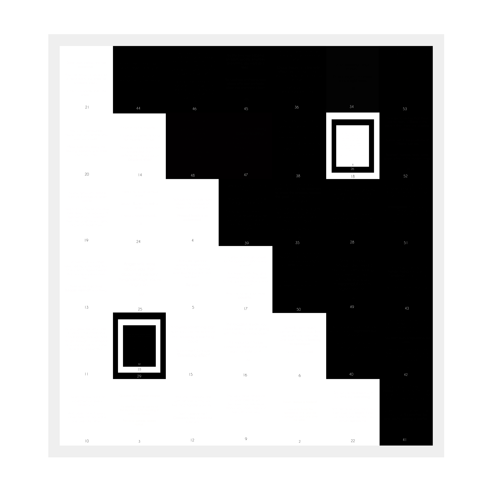

# Epilogue

Our ideologies change and we adopt. Evolution is the only thing that stands throughout.  

"I forgot a few other points I was trying to make. But it's alright because the subconscious takes care of it.  
I made a few mistakes and even learnt to adapt to some strange ways of dealing with them - Correction need not be a single way." Fred reminded Riya.  

"Evolution is a point of the experiment. The idea which started taking root during the experiment. Hence proved."  

"Tell me Riya", Fred said, "What was your most favourite time during the whole trip?"  

Riya didn't even flinch. "The elephants, the beautiful sky at the time and the next morning in the cottage," she said.  

"Exactly. Life is comprised of both days and nights - But even though most of your life is full of days and nights, it's the time between the two that makes the beautiful memories. The sunset and the sunrise. That's the allegory to life. No matter what you try to do, you always end up enjoying the moments that touch both the sides of life."  

"Like how it makes failures equivalent to success" Riya smiled.  

"Interesting effort though," she said after a moment of thinking. "Not sure if it conveys what it has to, but it's interesting nevertheless" 

Ferdinand smiled, "And finally, like I said, none of my posts/images are empty. If you edit them, you'll be able to see what's in them. But the reason I went with black on white and white on black was to convey the fact that you can only 'see' if you accept that most things are grey. Not black and white. That is to say, when you edit them, the image turns grey. Or you can see it as..."

Riya's eyes widened, "That you can only see if you're aware of both the extremes!" She understood his "allegory to life" comment. 

