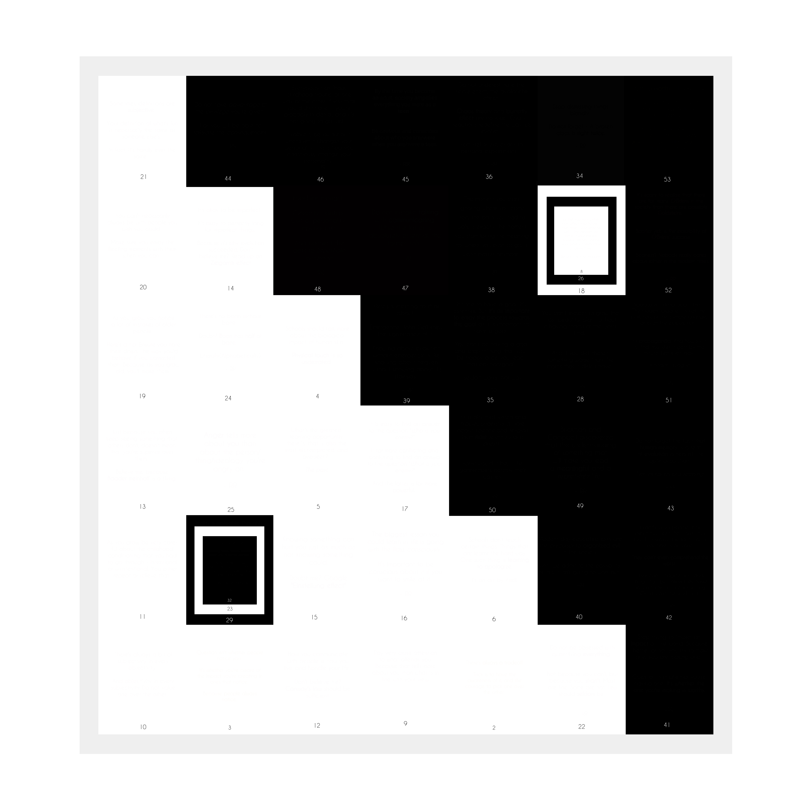

## The pity
> #### _On Why it all started_

“Where are we going?” Riya asked.  

He smiled. Wearing the helmet and getting on the bike.  

“And don’t you dare tell me it’s all about the journey” she said, wearing her helmet as she sat on the bike. *But of course, you’re going to say that. Because it really is all about the journey. I know. But it’s easier to look at it all from a simpler perspective.*  

“Of course, it’s about the journey” he said. Riya shook her head, rolling her eyes and facepalming — all at once.  

“But it isn’t only about the journey. It’s about *who* I journey with” he smiled. 

“The thing is, people are either focused on the destiny or about the arduous path they have to take to reach the destiny. Neither is going to help us. Neither is supposed to help us, of course. It’s just that, we don’t realize what’s important. Or perhaps, what’s worthy. As humans, we always strive for meaning. Our job has to *mean* something. Our actions have to *mean* something. Our relationships, our friendships, our lifestyle… it all has to *mean* something — or that’s what we all, one way or the other, aim at: ***Meaning***. If it doesn’t mean anything, why do it? Why exist at all?”

“Ag — reed. But…” Riya knew she was stepping into one of his typical conversations — those that satisfy one’s thirst for discussions, but also exhausts their ability to think clearly. This isn’t going to be easy — contradicting of course, but also draining. *You owe me, darling.* She thought as she continued to ponder into his conversation, “But to most people, it really doesn't matter. Not everybody looks for meaning when they do something” She slowed down as she said those words. It was hard to put that into a binary answer of yes or no.

“Very true. And that’s where I was going” he slowed down his bike. It was now half past ten. It was getting colder. By the looks of it, they were entering a small village. He stopped at a small tea shop — ordering two. 
Riya didn’t ask anything. She was busy looking around. It’s been long since she saw huts instead of big blocks of concretes. 

“Stark difference isn’t?” He asked looking at her exclaim at all these. 

“It sure is. Been real long since I’ve been to my house at the country side. Feels so foreign now to look at these things”. She could hear the crickets chirping nearby. She even heard a ringing sound in her ears once Fred switched off the bike ignition. It was *that* quiet. 

“What’s the audible equivalent to pitch-black?” she asked hinting at how quiet the environment was. The hot tea was complementing the cold breeze. She smiled at him. They were quite for a while. 

“So you’re really not gonna ask about it?” He initiated. 

“Why? So you can boast?” she smirked. She definitely knew what he was hinting at. 

Fred smiled. “You think you know me that well huh?”

“Well that and more. For instance, that you’ll pretty much be distracted by the fact that I didn’t ask about it”

Ferdinand was now just staring at her. Already planning counter-measures. You keep me challenged. 

“But hey, I’m going to make it easier for you — ” Riya smiled, aware of how anxious he already was, 
“What’s with those posts?”

Ferdinand grinned ear-to-ear. *You also know me well enough to not discourage my quirks*. “Well, here’s a food for thought then. Why do you think people love magic tricks?”

Riya rolled her eyes. Here we go. “Because we don’t know how they do a trick?” 

“Not really, no. If you know that the magician is going to take a rabbit out of a hat, there’s nothing exciting about it. You've seen it multiple times, it's almost as if it's a classic act of opening. You still may not know how he does it, but you know what he will do. But what if… What if this trick is different? What if he takes something out of the hat? What if — ”

“Of course yes, it’ll be interesting if he changes the trick”

“But what if, he does something out of the ordinary? What if he does something different? Something far from logical? Far from plausible? Far from sane? Like him unable to take his hand out. But instead, he slowly gets pulled into the hat? The hat gulping him down. Blood spattering on the floor. and the hat melting down into just a sheet of cloth?”

Riya was silent. Looking at his enthusiasm in trying to justify his benign attempt at an unreasonable explanation. 

“So you’re a magician now? Nice. Good to know” she smiled, her eye-brows burrowing. 

“Ha ha maybe. Maybe not. But that’s the thing” he said, “You don’t expect to be surprised by a physician or a chemist explaining the unexplained, right? But what makes this different? Because we yearn for the unknown”

“Oookay” she dragged it. 

---

He knew he had a lot to convey. He was thinking — to describe his attempt at a futile social experiment he had devised. 

“But I expect to get surprised when I go for a magic show. I know something is going to make me feel better. Just not what” Riya asked, “similarly, what am I supposed to expect from your *show*?” She was mildly mocking. 

“Many. But you still won’t expect the magician to reveal how he did it after the end of every trick, do you?”

“What? So you’re telling me, you’re not going to tell me anything at all?” her shocked face revealed that she was actually expecting him to say what it was that he was doing. Even though she never asked about it to him, her face said it all - *She was expecting a reveal!*

“No, I’ll tell you what the trick is supposed to be. You find out what it is” Fred smiled. 

He sat straight. “Okay. I learnt something so basic, but still incredible in this short hiatus I had. It’s this —you don’t have to be abundant to be useful. And that goes for everything. From the tiniest of the atoms, to the biggest of the nebulas: you don’t have to pack in everything, to be able to account for something” Riya was trying to make sense of what he’s saying. 

“One of the primary things modern technology, although a boon in a lot of ways, has destroyed something innate to humans; Innate to humanity; as a species is patience. No matter what we try to communicate, or build, or program — patience, next only to trust is one of the primary features of humans. 

“So you’re testing the patience of people by keeping them out of the loop?” 

“Not really. I am doing the best I can to not block them from doing the only thing they can do at the least, or at their best —Try”

“You can’t expect people to keep trying when they are not sure what they should be doing in the first place” 

“True. And that’s why, I have been giving out clues in all the not so obvious ways.
One of the things the modern world has accomplished is the leverage of short term memory and information overload. It has made people to not be able to connect the dots. And I am trying to make them connect the dots” 

“I understand the fact that people have grown impatient, Fred. But you can’t teach patience to impatient people by making them wait. It doesn’t work that way”
She tried appreciating what he’s trying to do — But she knows that it won’t work out. At least not like this. And as she said this, his expressions told that he is aware of this too. 

There was silence for a few minutes. They didn't talk anything. Thankfully, the ambience of the place was getting better. They paid for their teas and started again. 

It was almost half past six. The sun was setting, and the cold breeze on their face was complementing the warmth of their bodies. 

They stopped for their dinner. Their conversations were diverted for a while and they were catching up on their lives - Their work, friends, family. 

"So what made you take up this… This year long puzzle?" she asked. 

He smiled, for the conversation turned to his efforts. It's the end of the year. Exactly one year back, the last day of the past year, I still remember the day very clearly. Certainly not vividly though, there wasn't anything vivid about the day. I was sitting in my room, coding. I didn't receive any wishes at midnight. As a kid, I frequently visited the churches at midnight for the new year celebrations. There were fireworks, and even the last couple of years, it was so lively. 

Riya remembers him saying about how he used to sit on the portico of his home, and be able to look at the fireworks from there. It was clearly visible even though it was coming from the church from a nearby village. 

"But this last year, there wasn't many. The day just… continued. It was a rather normal day and by the end of the day, when I actually realized a new year's beginning, I was actually disappointed. On a lot of fronts. Of course, it included myself too. But nevertheless, the question did not change - 'What have we grown into?'" He took a break trying to recollect the way he felt at that moment. 

She remembered him telling about a lot of things that's bothering him lately regarding how we've grown up to be. It's not uncommon - Moving from our studies into the mythical adulthood where you're independent throwing you off. It's not what was promised to us, neither was it what we imagined or worked towards, but still we carry on. As if nothing is wrong about the way we were looking at it. 

"There's a reason why cultures used to have rituals, and festivals. Me of all people, a psychology fanatic, should be careful about utilizing the potential these cycles of life held within themselves. But why did I not do that? 

---

Why didn't people of my age do that? What's going on with us? Is this what's supposed to be adulthood? Or is this what we supposed adulthood should be? I was utterly annoyed and disappointed. Frustrated and confused. This was not what we were made for" 

Riya could sense that he was genuinely upset and disturbed about it. "You should calm down, dear" she wished she could tell him that. But she knows him. Sometimes people just want to be heard. Moreover,  you can't calm down someone by asking them to calm down - certainly does not work with him. 

"Imagine, Riya, the lunar module that landed through apollo had a processor whose computing capacity was lesser than that of the smartwatch that I'm wearing right now. Yet we talk and argue about things that are silly, point missiles and counter-missiles againspt one another. When we should all be working together as a whole. What if, just what if, a huge asteroid comes and hits earth? Wouldn't all the nations point their missiles at them? Do we take that into consideration first? We berate and look down on people who speak differently than us; who look a different shade than us; who come from a place we've never been to - Can you imagine how judgemental we become when we say a countries name even though we've never been to that country? Unless we travel to other places, they are not real. We have no idea about their life style, their situations, their opportunities, their way of living, their resources, yet we're quick to judge. How timid of us"

She has seen him go on about one of his tangents like this earlier. Multiple times in fact. But he never made her feel bored. She was getting lost in thougts by now. She started remembering the tiny things that people do to piss of others, the bullies she sees daily on her way to work, the people who don't give a crap about what others are going through - Even her work, colleagues shouting at each other as if that's what they were meant to do throughout their lives. Life is a complicated bundle of ropes Ferdinand used to say often. It has helped her stay out of troubles quite a few times. It helps her understand that we know very little about what others are going through. 

"But none of this matters. A single orchard cannot be a forest" he said under his breath. 

<!--  -->