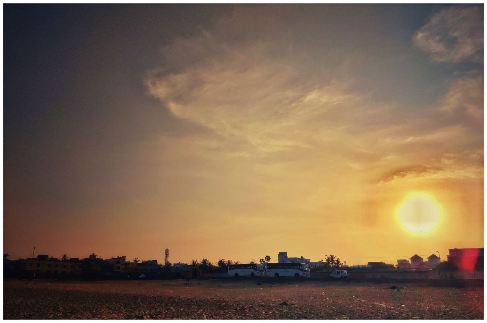
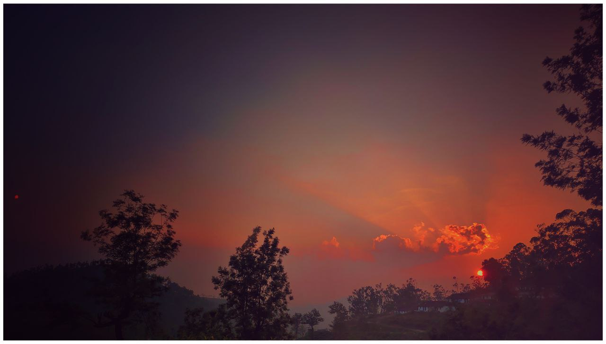

## Journey of a thousand miles

“Where are we going?” Riya asked.  

He smiled. Wearing the helmet and getting on the bike.  

“And don’t you dare tell me it’s all about the journey” she said, wearing her helmet as she sat on the bike. *But of course, you’re going to say that. Because it really is all about the journey. I know. But it’s easier to look at it all from a simpler perspective.*  

“Of course, it’s about the journey” he said. Riya shook her head, rolling her eyes and facepalming — all at once.  

“But it isn’t only about the journey. It’s about *who* I journey with” he smiled. 

“The thing is, people are either focused on the destiny *or* about the arduous path they have to take to reach the destiny. Neither is going to help us. Nor are they supposed to help us, of course. It’s just that, we don’t realize what’s important. Or perhaps, what’s worthy. As humans, we always strive for meaning. Our job has to *mean* something. Our actions have to *mean* something. Our relationships, our friendships, our lifestyle… it all has to *mean* something — or that’s what we all, one way or the other, aim at: ***Meaning***. If it doesn’t mean anything, why do it? Why exist at all?”

“Ag — reed. But…” Riya knew she was stepping into one of his typical conversations — those that satisfy one’s thirst for discussions, but also exhausts their ability to think clearly. This isn’t going to be easy — contradicting of course, but also draining. *You owe me, darling.* She thought as she continued to ponder into his conversation, “But to most people, it really doesn't matter. Not everybody looks for meaning when they do something” She slowed down as she said those words. It was hard to put that into a binary idea of yes or no.

### TODO: Change this to sunny image. The bright side of things

---
“Very true. And that’s where I was going” he slowed down his bike. It was now half past six. It was getting colder. By the looks of it, they were entering a small village. He stopped at a small tea shop — ordering two. 
Riya didn’t ask anything. She was busy looking around. It’s been long since she saw huts instead of big blocks of concretes. 

“Stark difference isn’t?” He asked looking at her exclaim at all these. 

“It sure is. Been real long since I’ve been to my house at the country side. Feels so foreign now to look at these things”. She could hear the crickets chirping nearby. She even heard a ringing sound in her ears once Fred switched off the bike ignition. It was *that* quiet. 

“What’s the audible equivalent to pitch-black?” she asked hinting at how quiet the environment was. The hot tea was complementing the cold breeze and to her surprise, the first sip of the tea made all the difference. It tasted better, a sharp taste of freshly grinded ginger added to its aroma. She smiled at him.

As they were enjoying the tea, the evening started waving it's good bye. The sky was turning orange. Fred pulled her and walked past a couple of trees behind the hut - It was hindering the view of what was behind the hut. Riya physically gasped when she saw what was in front of her eyes. There was an elephant and its calf. The elephant mahout was the one who prepared the tea for them. 

She exclaimed at him, who was now looking at an other side. She turned to find nothing but plains. And an empty sky. She was confused - "What are you looking at? There's an adorable baby elephant here, you dumbo!" 

He smiled, "It's now deep red" he said pointing at the sky. 

Riya was taken aback for a moment - *How did I not notice this?* It was a beautiful view of the sun painting the sky red. 

