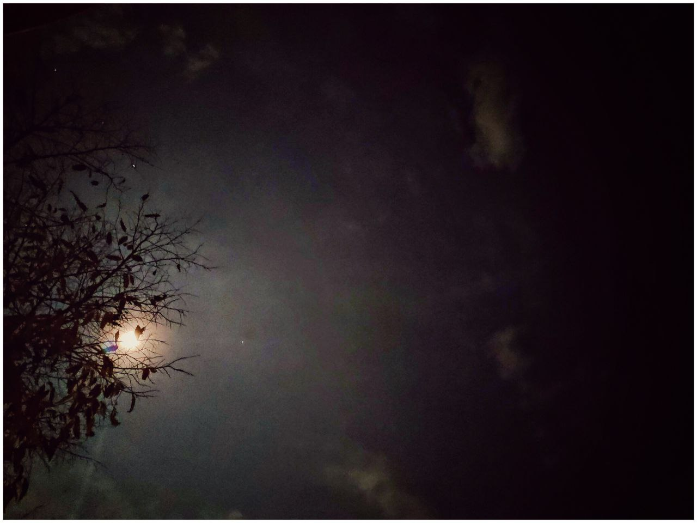

# Yesteryear Yearnings

"So what made you take up this… This year long puzzle?" she asked. 

He smiled, for the conversation turned to his efforts. It's the end of the year. Exactly one year back, the last day of the past year, I still remember the day very clearly. Certainly not vividly though, there wasn't anything vivid about the day. I was sitting in my room, coding. I didn't receive any wishes at midnight. As a kid, I frequently visited the churches at midnight for the new year celebrations. There were fireworks, and even the last couple of years, it was so lively. 

Riya remembers him saying about how he used to sit on the portico of his home, and be able to look at the fireworks from there. It was clearly visible even though it was coming from the church from a nearby village. 

"But this last year, there wasn't many. The day just… continued. It was a rather normal day and by the end of the day, when I actually realized a new year's beginning, I was actually disappointed. On a lot of fronts. Of course, it included myself too. But nevertheless, the question did not change - 'What have we grown into?'" He took a break trying to recollect the way he felt at that moment. 

She remembered him telling about a lot of things that's bothering him lately regarding how we've grown up to be. It's not uncommon - Moving from our studies into the mythical adulthood where we're independent, throwing you off mentally. It's neither what was promised to us, nor was it what we imagined or worked towards, but still we carry on. As if nothing is wrong about the way we were looking at it. 

---

Why didn't people of my age do that? What's going on with us? Is this what's supposed to be adulthood? Or is this what we supposed adulthood should be? I was utterly annoyed and disappointed. Frustrated and confused. This was not what we were made for" 

Riya could sense that he was genuinely upset and disturbed about it. "You should calm down, dear" she wished she could tell him that. But she knows him. Sometimes people just want to be heard. Moreover,  you can't calm down someone by asking them to calm down - certainly does not work with him. 

"Imagine, Riya, the lunar module that landed through apollo had a processor whose computing capacity was lesser than that of the smartwatch that I'm wearing right now. Yet we talk and argue about things that are silly, point missiles and counter-missiles againspt one another. When we should all be working together as a whole. What if, just what if, a huge asteroid comes and hits earth? Wouldn't all the nations point their missiles at them? Do we take that into consideration first? We berate and look down on people who speak differently than us; who look a different shade than us; who come from a place we've never been to - Can you imagine how judgemental we become when we say a countries name even though we've never been to that country? Unless we travel to other places, they are not real. We have no idea about their life style, their situations, their opportunities, their way of living, their resources, yet we're quick to judge. How timid of us"

She has seen him go on about one of his tangents like this earlier. Multiple times in fact. But he never made her feel bored. She was getting lost in thougts by now. She started remembering the tiny things that people do to piss of others, the bullies she sees daily on her way to work, the people who don't give a crap about what others are going through - Even her work, colleagues shouting at each other as if that's what they were meant to do throughout their lives. Life is a complicated bundle of ropes Ferdinand used to say often. It has helped her stay out of troubles quite a few times. It helps her understand that we know very little about what others are going through. 

"But none of this matters. A single orchard cannot be a forest" he said under his breath. 

